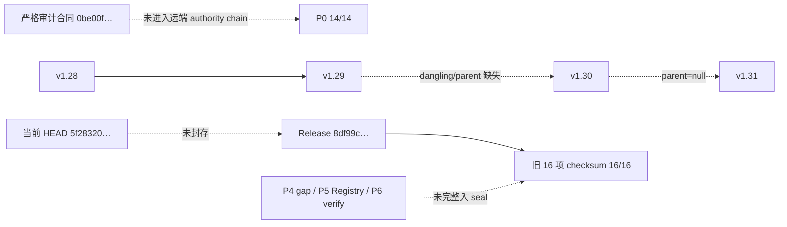

# RNA Junction Preorganization 项目执行后二次严格科研与工程审查

- 审查日期：2026-08-09（Asia/Shanghai）
- 远端审查快照：`cunyuliu@36.137.135.49:/home/cunyuliu/rna_junction_audit_20260807T090244Z`
- 远端结果根目录：`/mnt/cunyuliu/rna_junction_audit_20260807T090244Z`
- 本轮行为边界：只读检查；未修改远端合同、代码、数据或历史结果，未启动训练，未覆盖 run root，未 push。
- 审查方法：以代码、row-level artifact、manifest、数值诊断和原始论文为证据，采用 fail-closed 的 claim-to-evidence 裁定。

## 1. 执行摘要

### 1.1 一句话结论

项目真正要回答的是：**在正确处理 helix context 严格嵌套于 scaffold/operator 的设计、正确处理右删失并阻断依赖暴露后，junction sequence 是否仍包含可跨 sequence family 与 nested context/scaffold-bundle 迁移的 preorganization 增量信息；独立 operator transfer 则需新的 factorial 数据。** 当前可以确认 `support_aware_mixture` 候选失败，但不能确认核心 sequence 假设已经被否定；相反，右删失基线梯度、abstention 计分、null 聚合和运行血缘问题使现有 benchmark 本身失去 comparison eligibility。

### 1.2 当前裁定

| 对象 | 当前裁定 | 决定性依据 | 允许的表述 |
|---|---|---|---|
| `support_aware_mixture` | `FACT_CONFIRMED / NOT_PROMOTED` | 它实际是 K=11 edit-KNN 加距离阈值 abstention；在 supported rows 上与 P1 `edit_knn` 的 `mu`/`sigma` 逐点一致，且 symmetry、edit、context 三轴均显著落后配置基线 | “该具体候选在当前协议下失败” |
| 核心 sequence 假设 | `BLOCKED_WITH_EVIDENCE / CORE_HYPOTHESIS_UNKNOWN` | P1 参数基线梯度错误；P2 依赖失效基线且有事后重裁定；四个现有 split 均为单轴阻断，没有 simultaneous unseen sequence × nested-context/scaffold-bundle，且 context 与 scaffold 不正交 | “尚未被合格裁定” |
| P0 comparison eligibility | `BLOCKED_WITH_EVIDENCE` | 严格 Markdown 合同未进入远端 authority chain；manifest 未绑定真实 commit；RunDAG 有 dangling/parent-null；gate 不是实质 fail-closed | 不得继承 `P0_PASS_COMPARISON_ELIGIBLE` |
| P1 leaderboard | `INVALIDATED_OR_STALE` | 六个 parametric baseline 的 censored-row gradient 符号反转；optimizer 资格未闭合 | 修复并同协议重跑前不得排名 |
| P2 conditional signal | `UNKNOWN_NOT_ASSERTED` | comparator 数值失效；matched no-sequence latent-operator ablation 缺失；null 次数/统计量不足 | 不得写成 confirmatory sequence signal |
| P4 null 与“3-seed” | `INVALID_STATISTIC / INVALIDATED_OR_STALE` | null 把 permutation×fold 摊平，而 genuine 使用 fold mean；所谓三 seed 是 bootstrap RNG seed，不是三次模型训练 | 不得声称多 seed 稳健或 1000-null gate 通过 |
| P5 identifiability boundary | 当前 artifact：`DEVELOPMENT_ONLY / OVERCLAIMED`；潜在 benchmark boundary：`INFERENCE + REQUIRES_NEW_EVIDENCE` | 主要证据来自已知失效候选，且 d≥2/d=3 结果混入 abstain 占位计分，Registry schema 也读取错误 | 当前只能报告 tested-candidate failure；普遍 identifiability boundary 为 `UNKNOWN_NOT_ASSERTED` |
| P6 fresh replay | `DEVELOPMENT_ONLY / PARTIAL_REPLAY_CONFIRMED` | 选定 P4 输出数值一致，但复用了 P1 predictions 和 P3 gates，未从 canonical source 重建 P0→P6 | 不得称端到端 clean replay |
| SOTA | `SOTA_NOT_ADJUDICATED` | 没有同数据、同 split、同 censored likelihood、同 aggregation 的完整公开榜单；内部 leaderboard 又失效 | 不得使用 SOTA 或 best-under-protocol |
| 投稿 | `NO_SUBMISSION_AUTHORIZATION` | 方法贡献、可信主结果、joint generalization、可公开许可与完整 replay 均未闭合 | 当前不应按方法/机制论文投稿 |

### 1.3 最关键的新发现

1. `FACT_CONFIRMED`：`audit/benchmark/baselines.py:43–49` 先令 `d=-phi/Phi`，随后又执行 `grad += -(X.T @ d)/sigma`，导致 censored data gradient 方向反转。独立中心有限差分诊断得到解析梯度 `+2.512061`、有限差分 `−2.512061`、绝对误差 `5.024122`。同类实现复制到 `audit/benchmark/phase1_baselines.py` 的 motif、k-mer 和 position-aware 拟合器。
2. `FACT_CONFIRMED`：受影响的不只是一个模型，而是六个参数基线：`global_censor_intercept`、`train_only_scaffold`、`scaffold_context_hierarchy`、`motif_topology_hierarchy`、`onehot_kmer_ridge`、`position_aware_additive`。因此 P1 排行榜以及 P2/P3/P4 中**实际使用这六类 predictions 作 comparator 的具体对比**不能保留 comparison-eligible 状态。需要逐轴区分：P4 symmetry/edit 的 comparator 是 `corrected_v1_31`，scaffold 的 comparator 是 `edit_knn`，二者不直接受这个梯度 bug 影响；P4 context 使用 `train_only_scaffold`，直接受影响。Candidate C 的淘汰还由 supported-row 与 edit-KNN 同构、P3 inner gain 全负和 symmetry/edit 大幅负差独立支持，但正式排行榜仍须同协议重裁定。
3. `FACT_CONFIRMED`：`audit/benchmark/phase1_run.py:111–118` 无视 `support/abstain`，直接把占位 `mu=0` 纳入 NLL。scaffold LOMO 中 `corrected_v1_31` 与 `train_only_scaffold` 的 11,893 行均为 abstain，却被算出约 `80.4494` 的 NLL；这不是“灾难性负预测”，而是“没有 eligible prediction”。
4. `FACT_CONFIRMED`：候选 C 的 supported prediction 与 edit-KNN 完全同构；coverage-matched 比较后必然逐点打平 edit-KNN。它的失败可以淘汰候选，但不构成对所有 sequence representation、物理 ensemble 或 latent-operator 模型的反证。
5. `INFERENCE`：当前最有论文潜力的贡献不是一个新预测器，而是一个经过修复后可能成立的 benchmark/failure-boundary 结果：apparent sequence gain 对 operator/context exposure、support policy、删失实现和 estimand 的敏感性。但在 evaluator 修复、joint split、noise/power 分析和 clean replay 完成前，这条负向论文路线也尚未达到投稿资格。

### 1.4 项目阶段与首要决策

- 当前阶段：**A——工程/评估原型，尚未形成论文级方法贡献**。
- 严格评分：**17/50**。
- 主轨 A：先恢复数值合格、同协议、joint-blocked 的 benchmark，之后再判断能否形成受限的 benchmark/identifiability-boundary 论文。
- 条件轨 B：只有修复后存在 sequence increment，且 owner/legal 批准新测量或跨研究数据时，才申请 prospective mechanism 路线。
- 本轮未运行新实验，所以“修复后结果会怎样”一律标为 `REQUIRES_NEW_EVIDENCE`，不以当前负结果代替。

### 1.5 证据标签

| 标签 | 本报告中的含义 |
|---|---|
| `FACT_CONFIRMED` | 可由当前代码、数据、manifest、row-level artifact、数值复算或原始论文直接确认 |
| `INFERENCE` | 由多项事实共同支持，但尚未通过专门识别实验验证 |
| `UNKNOWN_NOT_ASSERTED` | 材料不足，当前不能作正向或负向主张 |
| `REQUIRES_NEW_EVIDENCE` | 必须通过新增实验、文献核验、新数据或授权才能回答 |
| `INVALIDATED_OR_STALE` | 已被更高优先级证据推翻，或与当前快照不一致 |
| `DEVELOPMENT_ONLY` | 工程/探索结果存在，但不能进入论文证据链 |
| `BLOCKED_WITH_EVIDENCE` | 已有明确 blocker，解除前禁止继承 PASS、promotion 或投稿状态 |

## 2. 项目真实状态

### 2.1 数据宇宙与有效独立单位

`FACT_CONFIRMED`：当前持久化 canonical source 位于 `/mnt/cunyuliu/rna_junction_audit_20260807T090244Z/source/tecto_v111_canonical_records.jsonl`，大小 20,812,186 bytes，SHA-256 为 `0989ddc00bb230fdb00bbc65433c943a0419e35c3d0799b481e741c4a24defe2`。`/tmp` 对应文件当前不存在；交接文档中“canonical source 仍在 `/tmp`”属于 `INVALIDATED_OR_STALE`。但原始获取链、来源授权和再分发许可仍为 `UNKNOWN_NOT_ASSERTED`。

| 层级/单位 | 当前数量 | 科学含义 |
|---|---:|---|
| raw rows | 28,935 | 原始/解析记录数，不是独立样本数 |
| admitted rows | 11,893 | 进入当前 benchmark 的观测行 |
| measured rows | 9,961 | 有精确 ΔG 的观测 |
| right-censored rows | 1,932 | 弱结合端 `Y ≥ −7.1 kcal/mol`；必须使用 survival likelihood |
| junctions | 1,336 | 更接近预测对象，但同一 junction 跨多个 context/scaffold 重复 |
| symmetry groups | 684 | symmetry 轴的独立重采样/划分单位 |
| edit components | 37 | edit 外推轴的独立组；数量小且 fold 极不平衡 |
| admitted helix contexts | 234 | context LOMO 单元；每个 helix context 只属于一个 scaffold，不是与 operator 正交的因素 |
| scaffolds/operators | 9 | 每个 scaffold 恰含 26 个 nested helix contexts；operator 外推与其整组 contexts 同时变化 |
| studies | 1 | 无跨研究复制 |
| 每 junction 暴露的 context–scaffold pairs | 4–9，中位数 9 | 重复暴露可能让 nested-context/operator calibration 看似 sequence generalization |

正确的样本量表述应同时报告 rows、junctions、sequence/symmetry/edit groups、contexts、operators 和 studies。不得将 11,893 行包装成 11,893 个独立实验单位。

### 2.1.1 Context–operator 严格嵌套是任务定义事实

`FACT_CONFIRMED`：从 admitted `CleaningLedger` 的 `helix_seq → scaf` 映射复算，234 个 `helix_seq` 每个都只映射到 1 个 scaffold；9 个 scaffolds 每个恰有 26 个 contexts。因此 context 与 scaffold/operator 不是两个可独立交叉的实验因素：

- `context_lomo` 的真实含义是 **unseen helix context within a seen scaffold/operator**；同一 scaffold 的其他 25 个 contexts 仍在训练中。
- `scaffold_lomo` 的真实含义是 **unseen scaffold/operator plus all 26 contexts nested under it**；它不能单独识别“operator effect”与“随 operator 一起变化的 context bundle”。
- 现有数据无法检验“同一个 helix context 跨不同 operators 的稳定效应”，因为这种交叉 cell 不存在。
- 未来 joint split 必须尊重嵌套结构；若要分离 context 与 operator，prospective design 必须将同一或匹配 context 真正跨接到多个 operators。

R0 必须新增 `ContextOperatorNestingManifest.json`，逐 context 登记唯一 scaffold、每 scaffold context 数、每 junction 暴露的 context–scaffold pairs，并把这个 nesting 写入 split/estimand/claim schema。否则即使 overlap 为零，也可能把 nested-context bundle 差异误写成独立 operator transfer。

### 2.2 完成度矩阵：有代码、能运行、结果可靠、足以支持论文

| 环节 | 已有代码/产物 | 可运行或已运行 | 有可靠结果 | 足以支持论文主张 | 证据与裁定 |
|---|---|---|---|---|---|
| 数据获取 | 有 canonical JSONL | 文件可读 | 部分 | 否 | 内容与 hash 可确认；acquisition chain、owner、license 未闭合，`BLOCKED_WITH_EVIDENCE` |
| 清洗与预处理 | 有 P0 cleaning/profile 脚本与 ledger | 已运行 | benchmark 快照内基本可用 | 否 | counts 可重建；公开再分发与源级 provenance 未闭合 |
| 删失语义 | 有右删失 contract 与部分正确实现 | corrected v1.31 可运行 | 局部可靠 | 否 | `−7.1` 为右删失；多个 parametric baseline 的梯度实现错误 |
| 数据划分 | 有 symmetry/edit/context/scaffold 四轴 split | 已生成 | 单轴 split 本身可复用 | 否 | 未有 joint sequence×nested-context/scaffold-bundle split；context/scaffold 留出仍大量复用 sequence；nesting 未进入原 task schema |
| 模型实现 | corrected v1.31、KNN、graph、候选 C 等均有代码 | 已运行 | 候选 C 的负结果方向可靠；其余依模型而异 | 否 | 候选 C 不是 mixture；v1.31 尚缺合格 comparator 与完整 convergence ledger |
| 训练流程 | 有 Phase 1/2/3 runner | 已运行 | 否 | 否 | 六个参数基线梯度错误；多个 fit 不检查 `optimizer.success`、最终梯度或边界 |
| 推理流程 | 有 row-level predictions | 已生成 | 支持区内部分可靠 | 否 | unknown sequence fallback 与 unseen operator abstention 语义不完整；占位值被错误计分 |
| 评估流程 | 有 NLL/scorer/bootstrap/null 代码 | 已运行 | 否 | 否 | full-coverage 与 selective prediction 未分开；不同 axis 混用不同 macro estimand；null 聚合失配 |
| 基线复现 | 注册 9 个内部 baseline families + `corrected_v1_31` reference candidate | 已运行 | 否 | 否 | 六个参数基线失效；Denny-train-only、RNAMake/physical prior、frozen RNA-LM 未完成；不能称“10 个公开强基线” |
| 消融实验 | 有 v1.31 数值修复、P2 null、P5 support 分层 | 部分运行 | 探索性 | 否 | 缺 matched no-sequence latent-operator ablation；P2 有 post-hoc amendment；P5 混入 abstain 占位 |
| 泛化实验 | 有四个单轴评估 | 已运行 | 只能说明各单轴行为 | 否 | 没有同时 unseen sequence×nested-context/scaffold-bundle，也没有能分离 context/operator 的 prospective 数据 |
| 可解释性/机制 | 有 P5 failure atlas 和 MechanismRegistry | 已生成 | 否 | 否 | Registry schema 读取错误；候选失败不能归纳为 sequence mechanism 不存在 |
| 复现性 | 有 checksum、P6 selected-output compare | 部分运行 | 仅 selected P4 数值一致 | 否 | 未从 canonical source 端到端重跑；实际 commands、完整 env 和当前 commit 未封存 |
| 工程质量 | 有 manifests、tests、status、release 包 | 可执行 | 部分 | 否 | gate 有硬编码/非 fail-closed；测试未覆盖 evaluator 核心错误；release 落后于 HEAD |
| 论文材料 | 有交接、报告、claim registry | 可阅读 | 否 | 否 | 当前主张混合候选失败、假设否定和 identifiability boundary；需整体重构 |

### 2.3 Authority、run lineage 与 release 状态

本地严格审计 Markdown `[rna_junction_v1_28_v1_31_strict_audit_2026-08-07.md](</Users/liucunyu/Documents/all_code/ZJU/mRNA_editflow/提示词/rna_junction_v1_28_v1_31_strict_audit_2026-08-07.md>)` 的 SHA-256 为 `0be00f01c316e989348a62fb0f717c32418ec24394b290edf97f57cfd7bbb2e2`，但远端 repository、run root、`CanonicalStateManifest.json` 和 `p01_config.json` 均未收录该文件或 hash。因此，它是本轮用户授权的审查规范，却不是既有 P0–P6 运行能够自证遵循的 authority artifact。

| Authority/血缘对象 | 仓库证据 | 当前状态 | 后果 |
|---|---|---|---|
| 根 `AGENTS.md` | 指向当前 checkout 不存在的 `contract/1.1.docx` | `INVALIDATED_OR_STALE` | 无法作为现行合同唯一入口 |
| `contract/CONTRACT_SCOPE.md` | 仍是旧 v1.1 DMS/transport scope，SHA `218dec…` | `INVALIDATED_OR_STALE` | 与本轮 junction strict audit 不同任务 |
| P0 authority config | 只登记 v1.2、v1.28–v1.31 docx | `FACT_CONFIRMED` | strict Markdown 未进入 execution authority chain |
| `CanonicalStateManifest.git.commit` | 字面值 `HEAD`，且记录 dirty audit/legacy | `BLOCKED_WITH_EVIDENCE` | 结果未绑定不可变代码 commit |
| `RunDAG.json` | 5 nodes、3 edges、1 dangling；v1.30/v1.31 parent 为 null | `BLOCKED_WITH_EVIDENCE` | 不能声称完整 parent-linked lineage |
| P0 gate | `p01_run.py` 将部分 conflict 标 `blocker=false`，并硬编码 `run_dag_built_without_cycles=true`；builder 未实质检测 cycle | `BLOCKED_WITH_EVIDENCE` | 14/14 只说明检查项写成 PASS，不等于 fail-closed authority PASS |
| 当前代码 | HEAD/origin main=`5f28320cf8262a2dd6c3f75fa06d0dc74719a2c3` | `FACT_CONFIRMED` | 当前审查快照 |
| Git tracking | 本地 `main` upstream 错指 `origin/audit/p2_20260809`，而非 `origin/main` | `INVALIDATED_OR_STALE` | `git status` 的 ahead/behind 不能直接解释为 main push 状态；新 worktree 必须显式绑定目标 branch |
| P3 实际 config | `p3_full_cfg.json` 未跟踪，且当前 `out_dir` 指向 `p3_full` 而非最终 `p3_full_v2` | `BLOCKED_WITH_EVIDENCE` | 最终 P3 artifact 缺版本绑定的实际运行配置 |
| final release | `ReleaseManifest`/`STATUS`/`REPRODUCE` 仍绑定 `8df99c154c…`；P6 config 又声称 `de7192f…` | `BLOCKED_WITH_EVIDENCE` | release、replay 与当前 HEAD 不一致 |
| MechanismRegistry | 生成器读取 `verdict/decision`，P4 实际字段为 `overall_promotion`；输出 `UNKNOWN/null` | `INVALIDATED_OR_STALE` | registry 未忠实反映 P4 verdict |
| Registry checksum | 内嵌 `cb1ea…`，最终文件实际 `1a489b…` | `INVALIDATED_OR_STALE` | self-hash 过程有二次写入漂移 |
| 许可 | dataset=`UNKNOWN_NEEDS_LEGAL_REVIEW`；code=`OPEN_SOURCE_PENDING`；repo 无 `LICENSE` | `BLOCKED_WITH_EVIDENCE` | 暂不能公开 release 或投稿 artifact |

### 2.4 “存在”不等于“可发布”的四层判定

| 对象 | 文件存在 | 字节/数值未漂移 | 运行可追溯 | 可公开发布 |
|---|---|---|---|---|
| canonical source | 是 | SHA 已记录 | 原始 acquisition chain 不完整 | 否，许可未闭合 |
| 旧 release 16 项 | 是 | 从 `/mnt` 复核 16/16 checksum 通过 | 只追溯到旧 commit/白名单 | 否，不是最新完整 release |
| P4 sealed outputs | 是 | P6 比较的数值一致 | 复用上游现成 predictions/gates | 否，不是端到端 replay |
| P4 gap / P5 registry / P6 verify | 是 | 局部可核验 | 未全部进入 release manifest；Registry hash/schema 有错 | 否 |
| 当前 repository | 是 | HEAD 可确认 | upstream 指向异常，release 未绑定当前 HEAD | 否 |

### 2.5 关键 artifact 证据索引

| Artifact | 本报告使用它确认什么 | 不能由它确认什么 |
|---|---|---|
| `/mnt/cunyuliu/rna_junction_audit_20260807T090244Z/p1_full/Leaderboard.csv` | 旧 axis/model 汇总、support/abstain counts | 梯度正确性、pooled-OOF 新 estimand、完整 baseline 资格 |
| `/mnt/cunyuliu/rna_junction_audit_20260807T090244Z/p1_full/Predictions.jsonl` | row-level旧预测与 P4 comparator 对齐 | fresh convergence、当前 authority lineage |
| `/mnt/cunyuliu/rna_junction_audit_20260807T090244Z/p2_full/CoreHypothesisDecision_v2_reedjudication.json` | 事后重裁定的内容与状态冲突 | executable/prospective confirmatory decision；仓库无对应生成器 |
| `/mnt/cunyuliu/rna_junction_audit_20260807T090244Z/p4_final/BootstrapIntervals.csv` | Candidate C sealed development fold-bootstrap | 正确多向 cluster uncertainty、P4 gap null |
| `/mnt/cunyuliu/rna_junction_audit_20260807T090244Z/p4_final/FinalPredictions.parquet` | Candidate C row predictions、与 edit-KNN 同构复算 | 新 pooled/joint benchmark |
| `/mnt/cunyuliu/rna_junction_audit_20260807T090244Z/p4_gap/NullAdjudication_full.csv` | permutation×fold 被摊平的实现结果 | 1000 个同 estimand axis-level null；raw permutation 不足以事后修复 |
| `/mnt/cunyuliu/rna_junction_audit_20260807T090244Z/p5_diagnostics/FailureAtlas.parquet` | d/support strata 的占位混入现象 | 普遍 identifiability boundary |
| `/mnt/cunyuliu/rna_junction_audit_20260807T090244Z/p5_diagnostics/MechanismRegistry.json` | Registry 实际 `UNKNOWN/null` 与 self-hash漂移 | 正确链接 P4 `overall_promotion` |
| `[交接文档_RNA_Junction_审计_20260809.md](</Users/liucunyu/Documents/all_code/ZJU/mRNA_editflow/交接文档_RNA_Junction_审计_20260809.md>)`，SHA-256 `75eac092604191228cf9cdf09c48f6fb55d60e808b46921c6ad955ffeb2b4b99` | 团队报告的执行状态与原主张 | 不能覆盖代码、row-level artifact、manifest 或原始论文；其中 `/tmp` source 表述已过时 |

### 2.6 当前测试与环境封存覆盖

`FACT_CONFIRMED`：实际发现的有效 pytest 文件主要是 `tests/audit/test_data.py`、`test_phase1_baselines.py`、`test_p2.py`、`test_support_aware_mixture.py` 和 `test_label_null_diagnostic.py`；没有发现覆盖 P3 selector、P4 promotion/null、P5 Registry、P6 completeness、共享 baseline finite difference、abstention scoring 或 duplicate prediction key 的测试。仓库也没有完整 CI/环境封存入口；`audit/release/environment.lock` 只记录环境名和 numpy/scipy/pandas/scikit-learn 等少量版本，不含完整 Python build、PyTorch/pyarrow、BLAS/CUDA、channels 或第二环境 lock。

另一个复现缺口是 seed 语义：P4 的“三 seed”只是 bootstrap RNG；P1 small MLP registry 写 `seed=0`，但其训练实现没有明确设置 PyTorch/CUDA deterministic seed。P6 又没有重跑 P1，因此随机模型的重复性为 `UNKNOWN_NOT_ASSERTED`。

## 3. 核心科学问题审查

### 3.1 重新定义后的科学问题

> **在一个预先冻结、删失感知、scaffold/nested-context-aware、依赖结构正确处理的评估协议中，junction sequence/physical-ensemble 表示是否能提供超出 matched no-sequence scaffold-bundle model 的增量信息，并能否同时迁移到未见 sequence family 与未见 nested context或scaffold+context bundle；若要声称独立 operator transfer，则能否在 prospective context×operator factorial 中复现？**

这个表述比“从 sequence 预测 ΔG”更严格，因为它明确了需要估计的是 sequence 的**条件增量**，而不是由重复 context、scaffold、motif、局部编辑邻居或 target-derived fingerprint 提供的可替代信号。

### 3.2 任务、输入、输出与 estimand

| 项目 | 严格定义 |
|---|---|
| 目标任务 | 对未见 junction group 预测 tectoRNA 平台中的 nested-context-conditional ΔG 分布；强主张要求 joint unseen sequence×nested-context，或 unseen sequence×scaffold-plus-context-bundle。只有 prospective factorial 才可单独主张 context 与 operator transfer |
| 可用输入 | junction 两段序列、预注册 topology/motif、训练期允许的物理特征、已知 scaffold/nested-context 标识；不得使用 test label、target measured fingerprint 或 test-derived calibration |
| 输出 | 每个 eligible junction–nested-context–scaffold 观测的 `mu`、`sigma`、`support`、`abstain`、`fallback_type`，以及可校准的右删失概率 |
| 主要 estimand | pooled OOF junction-macro right-censored NLL；另独立报告 context-macro 与 operator-macro，不以同一“NLL”名称混用 |
| 核心 contrast | full model − 完全 matched no-sequence latent scaffold-bundle model；两者只能差 sequence/physical 表示 |
| 关键不确定性 | group/multiway-cluster uncertainty，而非只对任意 5 folds 做 bootstrap |
| 部署边界 | known scaffold 内的新 nested context、unseen scaffold+context bundle、以及真正 factorial unseen operator transfer 必须分开；无支持时 abstain，不用占位预测伪装失败 |

### 3.3 最重要的科学假设

核心假设是：**在 scaffold/operator、helix context、motif/topology、局部邻域和删失边际被匹配控制后，sequence 或 train-only physical ensemble 仍携带可重复、方向一致、能在 joint-blocked split 中保留的 preorganization 信息。**

这个假设尚未被合格验证，也尚未被合格否定：

- `FACT_CONFIRMED`：候选 C 没有新增 representation 能力，supported prediction 就是 edit-KNN。
- `FACT_CONFIRMED`：当前四轴都是单轴留出；nested-context/scaffold-bundle 轴允许同一 junction/sequence 出现在训练集，且两轴因 nesting 不能被解释为独立效应。
- `FACT_CONFIRMED`：P2 full model 与 train-only scaffold baseline 同时改变了 sequence、latent structure、operator slope/variance 等多个能力维度，缺少 matched no-sequence ablation。
- `INFERENCE`：现有证据强烈反对“当前局部 KNN-gate 已学到 transferable mechanism”，但不支持“任何 sequence/ensemble 模型都无法学到 transferable mechanism”。

此外，context 与 scaffold 的严格嵌套意味着当前数据不能把二者作为两个正交 nuisance effects 同时识别。任何模型中新增显式 context term，都必须先通过嵌套设计下的 identifiability/rank 诊断；不能简单把 context random effect 与 scaffold effect 并列后解释为独立生物效应。

### 3.4 希望超越的现有方法与当前创新类型

原始 [Denny et al., Cell 2018](https://pmc.ncbi.nlm.nih.gov/articles/PMC6053692/) 已展示跨 scaffold 的 thermodynamic fingerprint，并用 stand-in conformational ensemble 解释 junction assembly energetics。其 native measured fingerprint 使用目标 junction 的实测信息，只能作为 oracle/机制参考；真正公平的 sequence predictor 必须使用 train-only 重构。 [Yesselman et al., PNAS 2019](https://pmc.ncbi.nlm.nih.gov/articles/PMC6708322/) 的 RNAMake-ΔΔG 提供物理 ensemble prior art，但预测对象主要是 helix/tertiary assembly，不是本项目完全同协议的 junction NLL。

| 当前对象 | 声称的创新 | 实际新增能力 | 创新类型裁定 |
|---|---|---|---|
| `support_aware_mixture` | support-aware mixture | edit-KNN + 二元 distance abstention；没有 mixture component 学习 | 工程策略；方法新颖性不足 |
| corrected v1.31 | hierarchical latent operator + Tobit/GH | 显式右删失、junction latent、scaffold intercept/slope、已知 operator 支持 | 建模整合；是否形成论文创新取决于 matched ablation 与 joint generalization |
| P0–P6 审计框架 | 可审计 benchmark | provenance、split、metric、null、release 的结构化约束 | 工程/评估整合；修复后可能形成 benchmark 贡献 |

因此，当前项目的核心创新不是概念上的新 biological mechanism，也不是已证明的新 sequence representation；最接近可保留的贡献是**严格评估协议与失败边界**。如果后续 physical ensemble 或 latent-operator sequence increment 在 joint holdout 与 prospective data 上成立，才可能升级为建模/机制贡献。

### 3.5 代码、实验和文档是否围绕同一问题

结论：**部分围绕，但没有闭合。**

- 数据和 corrected v1.31 的 censored likelihood 确实围绕 context-conditional thermodynamics。
- P3/P4 候选却退化为局部 edit-KNN 插值，其主能力是支持内邻域平滑，不是可迁移 preorganization 表征。
- P5 把该候选的失败扩展成一般 identifiability boundary，叙事超过了模型覆盖范围。
- P2 试图恢复 conditional signal，但使用了失效 baseline，并通过事后协议修订升级状态。
- 文档把“单轴 nested-context/scaffold-bundle 留出”“独立 operator transfer”“candidate failure”“核心 hypothesis falsification”相互替代，导致科学问题与证据对象错位。

论文叙事必须重新聚焦为：**严格 benchmark 能否在正确 evaluator、matched contrast 和 joint blocking 下识别 sequence increment；若不能，失败边界究竟来自数据设计、支持不足、噪声还是模型类。**

## 4. SOTA 距离分析

### 4.1 必须分别裁定的六个任务

| 任务 | 数据与划分 | 主要指标 | 必须比较的强基线 | 当前可确认结果 | SOTA 状态 | 主要泄漏/公平性问题 |
|---|---|---|---|---|---|---|
| 1. unseen symmetry group、known nested-context/scaffold | Denny admitted universe；5-fold symmetry grouped | pooled OOF junction-macro right-censored NLL、group bootstrap CI | matched no-sequence latent scaffold-bundle、motif/topology hierarchy、additive/ridge、edit-KNN、physical prior、frozen LM | 候选 C NLL `2.643742`，配置 comparator `corrected_v1_31` NLL `1.091236`，gain `−1.552506`，0/5 fold positive。该 comparator 不直接受六基线梯度 bug 影响，但尚缺同一新 authority/scorer 下的 fresh convergence/replay 资格 | `SOTA_NOT_ADJUDICATED` | known nested-context/scaffold 暴露不能支持 broader transfer；完整强基线未齐 |
| 2. unseen edit component、known nested-context/scaffold | 37 edit components；5-fold，fold 行数极不平衡 | 同上，按 edit component 重采样 | 同上，尤其 edit-KNN、mutation graph、position-aware/additive | 候选 C supported rows 8,765；NLL `2.553007` vs `corrected_v1_31` `1.151148`，gain `−1.401859`，0/5 positive。该 comparator 不直接受六基线梯度 bug 影响，但完整 comparison eligibility 未闭合 | `SOTA_NOT_ADJUDICATED` | d≥2 支持迅速下降；不能把 abstain 行占位计分；fold 极不平衡 |
| 3. known sequence、unseen nested helix context、seen scaffold | 234 context LOMO；每个 held-out context 的 scaffold 仍通过另外 25 contexts 出现在训练中 | nested-context-macro NLL；junction×context multiway cluster uncertainty | scaffold hierarchy、matched latent operator、sequence baselines | 候选 C `2.719532` vs 配置 comparator `train_only_scaffold` `1.406396`，31/234 positive；该 comparator 直接受梯度 bug 影响。P1 中 corrected v1.31 为 `1.140367`，还说明配置 comparator 并非当前表中最低者 | `SOTA_NOT_ADJUDICATED` | 同一 junction/sequence 和 scaffold 在训练集；只测 seen-scaffold 内 nested-context transfer |
| 4. known sequence、unseen scaffold及其全部 nested contexts | 9 scaffold LOMO；每个 scaffold 连同其 26 contexts 一起留出 | scaffold-bundle macro NLL、逐 scaffold sensitivity、coverage/abstention | no-sequence bundle prior、topology/physical fallback、显式 zero-shot policy | v1.31/scaffold baselines全 abstain，却被 `mu=0` 算成 `80.4494`；候选与 edit-KNN 完全同分 | `INVALIDATED_OR_STALE` | operator 与 context bundle 混杂；无合法预测器时应记 unsupported；n=9 不支持窄 CI |
| 5. simultaneous unseen sequence × unseen nested context（seen scaffold） | 尚未生成；需 edit/symmetry × context 二维阻断并保持 scaffold 可见 | pooled junction-macro + nested-context-macro；group/multiway uncertainty | matched hierarchy、KNN/graph、v1.31、physical prior、frozen LM | `NOT_RUN` | `SOTA_NOT_ADJUDICATED` | 两维需零重叠；必须明确这是 seen-scaffold 内迁移，不是 operator transfer |
| 6. simultaneous unseen sequence × unseen scaffold+context bundle | 尚未生成；需 edit/symmetry × scaffold 二维阻断 | pooled junction-macro + scaffold-bundle sensitivity；coverage | matched no-sequence bundle model、physical prior、明确 fallback | `NOT_RUN` | `SOTA_NOT_ADJUDICATED` | 只有9个 bundle；无法用现有数据拆分 operator 与 nested contexts；真正分离需 prospective factorial |

这里“当前结果”的资格必须逐轴解释：context comparator 直接失效；symmetry/edit 的 corrected v1.31 与 scaffold 的 edit-KNN 不受该梯度 bug 直接影响，但仍未经过新 authority、统一 scorer、完整 convergence 和强基线集合的 fresh adjudication。候选 C 的负向方向由 supported-row 同构、P3 inner-CV 及大幅负差共同支持；这些旧数值仍不能进入正式 leaderboard，也不能作为领域 SOTA 差距的精确估计。

还必须区分旧数值与未来 estimand：表中 `2.643742/2.553007/2.719532` 等是封存 runner 对**各 fold 的 junction-macro NLL 做未加权平均**所得的 stored mean-of-fold macro NLL。context 轴实际是 234 个 context-fold macro 的等权均值，scaffold 轴是 9 个 scaffold-fold macro 的等权均值，edit 轴也无视 fold 行数不平衡而五折等权。它们不是本报告未来冻结的 pooled-OOF junction-macro NLL；R0 必须并列重算 pooled、nested-context-macro 与 scaffold-bundle-macro，禁止把旧值当新 metric 的结果。

### 4.2 Prior art 与 task-equivalence

| 方法/论文 | 可比性 | 本项目应如何使用 | 禁止的比较 |
|---|---|---|---|
| [Denny et al., Cell 2018](https://pmc.ncbi.nlm.nih.gov/articles/PMC6053692/) | 同一实验平台与 junction thermodynamics，但 native fingerprint 含目标实测 context 信息 | native/oracle 机制参考；另做严格 train-only 重构 | 不把原论文 fingerprint 结果当纯 sequence baseline |
| [Yesselman et al., PNAS 2019](https://pmc.ncbi.nlm.nih.gov/articles/PMC6708322/) | physical ensemble prior art，任务对象/metric 不完全等价 | RNAMake ensemble、static-structure、topology-only 三分支 comparator | 不与 junction censored NLL 直接排公开名次 |
| [Lange et al., NAR 2024](https://academic.oup.com/nar/article/52/16/9953/7724680) | qMaPseq assay bridge；reference ΔG 与 Mg/DMS response 关系 | 受限的 assay bridge；登记是否使用同变体 reference label | 不把同一变体实测 `old_dg` 当独立外部泛化 |
| [Geng et al., Cell 2026](https://pubmed.ncbi.nlm.nih.gov/41856113/) | 宽泛的 sequence→conformational ensemble→binding/function 邻近叙事 | 约束该条宽泛链路的 novelty/first-of-kind claim；不自动否定 tectoRNA-specific benchmark 的局部新颖性 | 不得声称宽泛链路 first-of-kind；任何更窄优先权仍需逐 claim 系统检索 |
| [trRosettaRNA2, Nature Machine Intelligence 2026](https://www.nature.com/articles/s42256-026-01223-x) | RNA 3D/conformer 邻近能力，不是同一 thermodynamic prediction task | 作为结构表征能力边界与 potential frozen feature source | 不与本项目 NLL 横向排名 |
| RNA foundation models | 预训练语料和任务均不同 | frozen embeddings + 统一低容量 downstream head；登记预训练 exposure | 不把“加入大模型”视为核心创新，也不在预算不匹配时宣称公平超越 |

截至本次定向检索，未发现“同一 Denny 数据、同一 joint/group split、同一 right-censored likelihood、同一 aggregation”的公开 leaderboard。这个结论只表示**本次检索未找到直接同协议比较**，不是证明全世界不存在。因此即使修复后内部最好，也最多先写 `BEST_UNDER_FROZEN_PUBLIC_PROTOCOL`；当前连这一状态也未建立。

### 4.3 距离竞争力结果的根因排序

| 候选原因 | 证据强度 | 本项目中的实际表现 | 优先级 |
|---|---|---|---|
| 评估/数值实现错误 | `FACT_CONFIRMED` | censored gradient 反号；abstain 占位计分；null estimand 不匹配 | P0，先于任何模型工作 |
| 数据划分与 estimand 不足 | `FACT_CONFIRMED` | 只有单轴阻断；context/scaffold 复用 sequence；不同 macro 被混称 NLL | P0 |
| 基线不公平/不完整 | `FACT_CONFIRMED` | 六个参数 baseline 失效；缺 matched no-sequence、Denny-train-only、physical prior、frozen LM | P0/P1 |
| 数据规模与结构 | `FACT_CONFIRMED + INFERENCE` | 单一 study、9 operators、37 edit components、重复 context 暴露 | P0 可行性与 power；可能成为不可修复边界 |
| 损失与训练目标不一致 | `FACT_CONFIRMED` | candidate/KNN 将 censored `−7.1` 当精确值平均；scorer 与 support policy 不一致 | P0/P1 |
| 归纳偏置不合理 | `FACT_CONFIRMED` | candidate 是局部 edit-distance 插值，不能表示物理 ensemble 或 operator interaction | 淘汰 Candidate C；有限研究替代方向 |
| 表征能力不足 | `INFERENCE` | v1.31 仅 63 维短位置特征；candidate 仅 edit distance；可能漏掉长程/构象信息 | evaluator 合格后再检验 |
| 训练策略不足 | `INFERENCE` | optimizer 状态/边界/最终梯度未系统封存 | P0 数值 ledger |
| 推理解码不足 | 低相关 | 连续 ΔG 分布预测无复杂 decoder；主要问题是支持与校准 | 非优先项 |
| 科学问题定义过宽 | `FACT_CONFIRMED` | 从 known-operator conditional prediction 跳到 transferable mechanism/identifiability theorem | 立即收缩 claim boundary |

核心判断：当前距离可发表/SOTA 的最大差距不是“网络还不够深”，而是**evaluator、matched contrast、joint generalization、effective N 和外部数据资格尚未建立**。模型架构只是在这些问题之后的第二层变量。

## 5. 发表潜力评分

### 5.1 严格评分

评分锚点：1=缺失、失效或被证据反驳；2=探索性；3=单数据内稳健；4=多 split/外部稳健；5=prospective 独立复现。

| 维度 | 分数 | 评分依据 |
|---|---:|---|
| 1. 科学问题的重要性 | 4/5 | RNA junction preorganization、thermodynamic transfer 与 sequence-to-function 具有明确生命科学价值；问题本身重要 |
| 2. 现有方法的明确局限 | 3/5 | target fingerprint oracle、context-within-scaffold nesting/confounding 和 censored evaluation 局限清晰，但尚未用完全公平协议系统量化 |
| 3. 核心方法的新颖性 | 1/5 | Candidate C 与 edit-KNN 同构；v1.31 是合理建模整合，但未证明新增能力或优于 matched comparator |
| 4. 跨任务/跨领域意义 | 1/5 | 仅单一 study、单平台、9 operators；没有跨研究或 prospective 迁移证据 |
| 5. 实验设计完整性 | 2/5 | 有四轴、null、support、release 的框架，但 joint split、matched ablation、正确 null 与 prior art 基线缺失 |
| 6. 结果可信度 | 1/5 | 核心 leaderboard 的 baseline gradient 错误，scorer 违规处理 abstain，P4 null 统计量失配 |
| 7. 机制解释/科学发现 | 1/5 | 当前只可靠证明具体 KNN-gate 候选失败；不能回答 sequence mechanism 是否存在或为什么有效 |
| 8. 泛化能力 | 1/5 | 只有单轴留出；operator holdout 实际无合法预测；无 joint、跨 study 或 prospective evidence |
| 9. 可复现性 | 2/5 | 旧 checksum 和 selected P4 数值能复核，但 authority、current commit、完整环境与 raw→final replay 未闭合 |
| 10. 论文故事完整性 | 1/5 | 当前故事把 candidate failure 扩写成 hypothesis falsification/identifiability boundary，关键逻辑断裂 |
| **总分** | **17/50** | **当前不具备方法/机制论文投稿资格** |

### 5.2 阶段判定

**单一阶段判定：A——目前主要是工程/评估原型，尚未形成论文级科学贡献。**

进入 B（一般领域论文雏形）的必要条件不是模型涨分，而是：

1. 撤销旧 comparison eligibility，统一修复 censored objective/gradient 和 abstention scorer；
2. 用完全相同 eligible rows、support policy、split、metric、预算重跑受影响基线与 corrected v1.31；
3. 建立 matched no-sequence latent scaffold-bundle ablation 和 joint sequence×nested-context/scaffold-bundle split；
4. 将每次 null permutation 聚合成与 genuine 完全同定义的 axis-level statistic；
5. 按真实独立单位估计不确定性，完成 noise ceiling、effective N 与 power analysis；
6. 形成可端到端重放且许可允许公开的 benchmark artifact；
7. 得到一个不依赖 post-hoc protocol amendment 的冻结结论——无论是受限正结果还是受限负结果。

### 5.3 特别判断

- **当前工作是否只是“已有框架加模块并提高指标”？** Candidate C 甚至没有形成独立 mixture 架构，只是在 edit-KNN 上增加 hard abstention；因此比“加模块”更弱，属于 support policy 包装。
- **是否有清晰核心发现？** 当前唯一高置信发现是“现有 benchmark/evaluator 会把错误梯度、unsupported prediction 和重复暴露混入科学裁定”。这是潜在 benchmark 发现，不是 biological mechanism。
- **能否回答为什么方法有效？** 不能。Candidate C 没有效；P2 corrected v1.31 的 apparent gain 又没有 matched no-sequence contrast。
- **能否产生超出单一 benchmark 的认识？** 目前不能。若修复后系统证明 RNA thermodynamic benchmark 对 exposure/support/censor handling 的敏感性，才可能形成可迁移的评估认识。
- **即使达到某个内部 SOTA，是否仍缺广泛价值？** 是。没有 joint transfer、跨 study/prospective evidence 和机制干预时，内部 NLL 最优仍只代表单平台协议内的 conditional predictor。

## 6. 模型架构问题

### 6.1 corrected v1.31 的真实数据流

核心实现位于 `audit/numerics/v131_corrected_objective.py:72–135`，而不是报告中的概念图。实际数据流为：

`canonical admitted rows → junction-level 63-D sequence features → latent q_j → scaffold-specific affine operator (a_s, b_s) → measured/right-censored Gaussian likelihood → GH48 marginalization → L-BFGS-B fit → known-operator prediction or abstention`

| 架构环节 | 当前实现 | 审查结论 |
|---|---|---|
| 输入表示 | 两个 junction parts 各取前 7 nt 做 one-hot：`2×7×4=56`；另加 nucleotide composition 4、总长度 1、两段长度 2，共 63 维 | `FACT_CONFIRMED`；短、可审计，但超过前 7 nt 的位置细节被丢失，不能表示一般长程相互作用 |
| 特征编码 | 固定手工特征，无 learned encoder | 可作为低容量科学基线；不应包装为 foundation/representation innovation |
| 主干网络 | 不是神经网络；`q_j ~ Normal(x_j^T θ, 1)` 的一维 junction latent | 有利于可识别与低样本，但表达上限受一维 latent 和线性 sequence map 限制 |
| 条件信息注入 | `Y_js | q_j ~ Normal(a_s + b_s q_j, 0.7²)`；scaffold-specific intercept/slope | 必要的 scaffold-bundle calibration；当前没有显式 nested helix-context latent/random effect，且因 context 严格嵌套于 scaffold，现有数据不能把两者解释为独立效应 |
| 跨区域/模态交互 | 两段序列只在拼接后的线性特征与 composition/length 层面交互 | 无显式 base-pair、tertiary contact、ensemble 或 two-part cross-attention |
| 输出头 | `a_s + b_s q_j` 的 Gaussian location；观测噪声固定为 0.7 | 可输出条件均值；uncertainty 的校准自由度有限 |
| 损失函数 | measured 行使用 Gaussian density；`Y≥−7.1` 的 censored 行使用 survival term；对 latent q 用 Gauss–Hermite 积分 | 方向正确，是必须保留的核心设计 |
| 约束机制 | 参数边界 + 正则 + 固定 latent/observation scale | 有助于稳定，但可能把不可识别问题隐藏为边界命中；当前 ledger 未系统报告所有 fold 的 projected gradient/bound hits |
| 训练/推理差异 | 训练只估计有支持 scaffold 的 operator；推理到 unseen scaffold 时 abstain | known-operator 条件模型，不是 operator-transfer 模型 |
| 数值验证 | corrected objective 的 synthetic 相对 gradient error `2.03×10⁻⁷`，真实初始化附近 `2.07×10⁻⁶`；GH48 vs GH64 objective 差 `3.44×10⁻⁶` | objective-level 数值修复有证据；尚缺预注册的 prediction-level quadrature 最大差和所有 fold convergence ledger |

其边际 likelihood 可概括为：

\[
q_j \sim \mathcal N(x_j^\top\theta,1),\qquad
Y_{js}\mid q_j \sim \mathcal N(a_s+b_s q_j,0.7^2).
\]

measured rows 使用密度；弱结合 capped rows 使用 \(P(Y_{js}\ge -7.1)\)。对于固定 GH 节点数 \(G=48\)，一次 objective/gradient 的主要成本近似为 `O(N_rows·G + N_junction·G + p)`；若优化迭代数为 `I`，总成本为 `O(I·(...))`。空间主要是 row/junction design 和 GH 中间量，明显优于全 pairwise sequence model，但表达能力也更受限。

### 6.2 parametric baselines 的共同数值缺陷

对于右删失行令 \(t=(\mu-c)/\sigma\)，negative log survival 为 \(-\log \Phi(t)\)，其 \(\partial\mathrm{NLL}/\partial\mu=-\phi(t)/(\sigma\Phi(t))\)：提高 `mu` 应提高 `P(Y≥c)` 并降低 censored-row NLL。当前 `audit/benchmark/baselines.py:43–49` 先写 `d=-phi/Phi`，又在外层加负号，返回相反方向。该缺陷复制到 `audit/benchmark/phase1_baselines.py` 的多个拟合器。

这不是轻微优化误差：解析梯度 `+2.512061` 与中心有限差分 `−2.512061` 符号相反。即使优化器输出看似有限、NLL 看似合理，也不能据此认定收敛到目标函数的解。当前多个 fit 只取 `res.x`，没有把 `success`、最终 projected gradient、边界命中和 NaN/Inf 作为 fold gate，因此“代码运行结束”不等于“拟合有数值资格”。

### 6.3 `support_aware_mixture` 的真实数据流

实现位于 `audit/models/support_aware_mixture.py:123–166`，与 `audit/benchmark/phase1_baselines.py:335–374` 的 edit-KNN 对照后，实际流程是：

`junction sequence → 全局 Levenshtein 距离矩阵 → 训练序列的局部均值 → K=11 nearest-sequence mean → fixed sigma=0.7 → min-edit-distance hard gate → supported prediction 或 abstain`

| 环节 | 事实 | 科学后果 |
|---|---|---|
| “mixture” | 没有多个 expert、没有连续 mixture weight、没有 learned gate | 名称与能力不一致；必须改称 `edit-KNN with distance abstention` |
| target aggregation | censored `−7.1` 被当精确值进入训练序列均值 | 训练不是 censor-aware；对弱结合序列产生系统偏差风险 |
| candidate vs edit-KNN | 四轴 supported rows 上 `max|Δmu|=1.78×10⁻¹⁵`、`max|Δsigma|=1.11×10⁻¹⁶` | 两者是同一预测器；coverage matching 后理论上必然同分 |
| support feature | `n_neighbors` 等按重复训练 rows 计数，而非独立 sequence/edit groups | 多 scaffold/context 重复会膨胀支持度，产生“有很多邻居”的错觉 |
| gate selection | P3 `_select_gate` 在所有 inner gain≤0 时仍选“最不负”gate | 违反 CandidateRegistry 的淘汰条件；selection 不 fail-closed |
| unknown sequence | prospective sequence 不在 admitted index 时 `_seq_index=-1`，后续回落到 `ti=0` | 可能错误使用第一个已知序列的距离行；真实部署不安全 |
| nested context/scaffold | 无显式条件注入；只通过训练 rows 的 target mean 间接混入 | 无法区分 sequence effect、已见 scaffold calibration 与其 nested context bundle |
| uncertainty | `sigma=0.7` 固定，无邻域/外推校准 | interval/coverage 主张缺依据 |
| 复杂度 | 预计算 unique-sequence Levenshtein 矩阵约 `O(U²L²)` 时间、`O(U²)` 空间；预测还需近邻排序 | 对更大 sequence universe 不具长序列/大样本扩展性 |

### 6.4 P3、P4、P5 的架构—评估逻辑断裂

- `FACT_CONFIRMED`：P3 inner mean gain 在 symmetry、edit、context 分别约为 `−1.462276`、`−1.168949`、`−1.328943`，对应 catastrophic counts 为 5/5、5/5、197/234；代码仍选择 gate 并把阶段标为 PASS。
- `FACT_CONFIRMED`：P4 coverage-matched 的候选与 edit-KNN 是同一 predictor，因此 scaffold 轴精确打平不是机制证据，而是实现同构的必然结果。
- `FACT_CONFIRMED`：P4 context 轴配置 comparator 为 `train_only_scaffold`（NLL `1.406396`），但同一 P1 artifact 中 corrected v1.31 为 `1.140367`；“strongest comparator”表述不实。使用真正较强 comparator 只会让候选更差，不改变淘汰方向。
- `FACT_CONFIRMED`：P5 d=2 的 supported subset NLL 约 `2.6975`，另有 1,906 个 abstain 占位行被算成约 `83.3766`；d=3 的 1,222 行全部 abstain，约 `81.7391` 完全是占位计分。正确表述应是“d=3 coverage=0，性能未裁定”，不是“模型在 d=3 爆炸”。

#### P2 旧信号为什么不能直接继承

| 轴 | 封存 mean gain：corrected v1.31 − train-only scaffold | 正向 folds | 封存 bootstrap 95% CI | 当前资格 |
|---|---:|---:|---:|---|
| symmetry | `+0.090680` | 5/5 | `[0.067907, 0.124454]` | comparator 梯度错误；`UNKNOWN_NOT_ASSERTED` |
| edit | `+0.088475` | 3/5 | `[−0.101658, 0.258122]` | comparator 梯度错误且 CI 跨0；`UNKNOWN_NOT_ASSERTED` |
| nested context | `+0.266029` | 104/234 | `[0.147012, 0.388976]` | comparator 梯度错误；同 sequence/scaffold 暴露；`UNKNOWN_NOT_ASSERTED` |
| scaffold bundle | `0` | 0/9 | `[0,0]` | 两模型全 abstain 后占位计分；`INVALIDATED_OR_STALE` |

原 `STATUS.json` 仍是 `FAIL/H0_OR_INCONCLUSIVE`；事后 `CoreHypothesisDecision_v2_reedjudication.json` 删除原 label-null 后改写为 `CONDITIONAL_KNOWN_OPERATOR_SIGNAL`，且仓库中没有对应生成器。label-null 因“每 junction 只有一个 sequence”而结构上不可置换，这个诊断合理，但只能触发 prospective protocol amendment，不能在看到失败后用同一数据自动升级为 confirmatory PASS。context/scaffold pairing null 又只运行 100 次，而冻结最低门槛为 1000；context observed `0.266029` 仅比 null p97.5 `0.251388` 高 `0.014641`。因此 P2 正信号与负信号都必须 fresh 重裁定。

#### P4 adjudicator 本身不具未来候选的晋升资格

`audit/p4/p4_run.py:306–325` 的 promotion 只检查 CI lower>0、all folds positive 和 relative gain≥10%，没有把 null separation、catastrophic fold、blocked edit/context、coverage/width/calibration 纳入同一个机器 gate；`p4_run.py:196–200` 又用 candidate absolute NLL `>30` 定义 catastrophic，而冻结协议按 relative baseline gain `<−10%` 定义。P4 gap null 还固定 genuine support subset，只置换 prediction pairing，未重新拟合 sequence-dependent support gate，因此最多是 conditional fixed-support null。上述问题不改变 Candidate C 已明显为负的方向，却意味着这个 adjudicator 不能用于未来正向 candidate，必须由 `FrozenGateSpec` 和新的统一 validator 取代。

### 6.5 必要、冗余、合理但未验证、限制上限的设计

| 类别 | 设计 | 判断 |
|---|---|---|
| 真正必要 | 右删失 proper likelihood、grouped/nested-joint split、scaffold与nested-context的正确层级表示、support/abstention、row-level predictions、matched no-sequence comparator | 直接对应 estimand 与部署边界，必须保留；不得把嵌套因素强行当正交效应 |
| 可保留的低容量选择 | 一维 latent q、线性 63-D features、partial pooling | 适合作为科学基线，但不自动构成创新 |
| 冗余/应淘汰 | Candidate C 的“mixture”包装、与 edit-KNN 重复的 predictor、所有 inner gain≤0 后仍继续 gate search | 不增加能力，只增加选择自由度与叙事风险 |
| 合理但缺实验支持 | scaffold slope/intercept、固定 sigma=0.7、GH48、63-D sequence map | 需要 matched ablation、calibration、quadrature prediction test 与边界 ledger |
| 限制模型上限 | 仅前 7 nt 位置特征、无显式 context latent、无 physical ensemble、known-scaffold-only、单一 study | 可能遗漏真正 preorganization 信号，但须在合格 benchmark 上证实 |

### 6.6 训练目标、评价指标与表面提升风险

1. Candidate/KNN 将右删失 cap 当精确 label，而 final scorer 试图评估 censored likelihood，存在训练—评价目标不一致。
2. scorer 将 `abstain=true` 的占位 `mu=0` 纳入主 NLL，把“不预测”误写成“极差预测”。
3. P4 null 与 genuine 使用不同 aggregation unit，可能产生表面显著性。
4. 复用同 junction/sequence 的 context/scaffold 留出只能测 seen-scaffold 内 nested-context calibration或scaffold-bundle行为，不能测 simultaneous sequence transfer，更不能独立分离 context 与 operator。
5. support 邻居数按重复 rows 膨胀，可能让低独立支持看似高覆盖。
6. Denny native target fingerprint、同变体 qMaP reference ΔG 或 test-derived operator calibration 若进入 predictor，会产生 oracle/label leakage；当前尚无证据证明这些进入了 Candidate C，但未来 baseline 必须登记 exposure。

**架构路线判断：不应继续局部优化 Candidate C，也不应现在扩大深模型。** 先恢复 evaluator 和 matched contrast；之后只允许重新裁定 corrected v1.31 与一个 train-only physical ensemble prior。若二者都不能超过强简单基线，就停止方法扩展。

## 7. 最不确定的三个问题

### 7.1 修复基线后，corrected v1.31 是否仍有独立的 sequence increment？

| 要素 | 审查结论 |
|---|---|
| 为什么当前无法确认 | P2 comparator 来自梯度错误的 `train_only_scaffold`；full model 与 baseline 同时改变 latent/operator/variance/sequence；`CoreHypothesisDecision_v2_reedjudication.json` 在看到原 FAIL 后删除 label-null 并改判，但仓库无可追溯生成器，原 `STATUS.json` 仍是 FAIL/H0_OR_INCONCLUSIVE |
| 对论文/SOTA的影响 | 若增量消失，方法故事终止；若仅 known operator 内存在，只能形成 conditional predictor；若 joint holdout 仍存在，才值得申请新数据 |
| 需要的证据 | 修复后六个 baseline；matched no-sequence latent-operator model；完全相同 outer folds/eligible rows/scorer；1000 axis-level pairing null；group/multiway uncertainty |
| 最小验证实验 | 冻结 corrected v1.31 与 matched no-sequence v1.31，仅移除 sequence map；重跑 symmetry、edit、context 和两个可行 joint split，保存每行预测与 fold optimizer ledger |
| 正面结果 | genuine gain 超过 matched ablation 与全部 null，group CI>0，并在 joint split 保留；说明 sequence increment 值得进一步验证 |
| 负面结果 | gain≈0/负，或只在 known scaffold/nested-context 轴为正；说明 apparent signal 主要来自 scaffold-bundle calibration或模型差异 |
| 负面后的调整 | 停止 sequence-method 扩展，进入 benchmark 轨 A；不得继续通过换 head、加 layer 或移动阈值追正结果 |

### 7.2 单一研究数据在 joint unseen sequence×nested-context/scaffold-bundle 下是否还有可识别信号？

| 要素 | 审查结论 |
|---|---|
| 为什么当前无法确认 | `build_splits.py:38–79` 只生成四个单轴 split；context LOMO 中同一 junction/symmetry 大量存在于训练集；scaffold LOMO 也是 known-sequence copying；更关键的是234 contexts严格嵌套于9 scaffolds，现有数据没有 context×operator 的交叉；37 edit components 与这些 nested bundles 的交叉可能高度稀疏 |
| 对论文/SOTA的影响 | 这是 transferable mechanism claim 的识别前提；若无可行测试单元或 power 极低，当前数据不能回答核心问题 |
| 需要的证据 | `ContextOperatorNestingManifest`；edit×nested-context、symmetry/edit×scaffold-bundle contingency 表；joint split feasibility；effective independent N；noise ceiling；group-aware power analysis |
| 最小验证实验 | 不训练新模型，先确认 nesting 并生成二维支持报告；对每个 joint fold验证 sequence group 与 nested context或scaffold bundle 均零重叠，再用最简单 global/hierarchy/KNN/v1.31 做冻结评估 |
| 正面结果 | 存在足量 joint test groups，matched model gain方向一致且 CI 可辨识；当前数据可继续条件验证 |
| 负面结果 | joint folds 大量空集/零支持，或最小可检测效应远大于科学上有意义的 1 kcal/mol 目标；数据本身不足 |
| 负面后的调整 | 将论文限定为 benchmark design/power boundary；若该边界也不新颖或不可公开，则必须申请新数据或终止 |

### 7.3 新 operator、新 study 或 prospective constructs 能否取得并合法发布？

| 要素 | 审查结论 |
|---|---|
| 为什么当前无法确认 | 当前只有一个 study；`LicenseLedger.csv` 对 dataset 为 `UNKNOWN_NEEDS_LEGAL_REVIEW`、code 为 `OPEN_SOURCE_PENDING`；无 owner-approved prospective measurement budget/协议 |
| 对论文/SOTA的影响 | 没有外部系统证据，机制/广泛泛化主张上限很低；许可不闭合则 benchmark artifact 也不能公开 |
| 需要的证据 | owner/legal 书面授权；数据使用/再分发条款；新 constructs 与 operator 的实验设计、预算、时间线和预注册 |
| 最小验证实验 | 先完成许可决策和 group-aware power analysis；只在 D1 joint signal 为正时设计最小 factorial prospective panel，不先大规模测量 |
| 正面结果 | 可合法获得并发布真正 unseen sequence×operator 组合及独立重复；允许轨 B |
| 负面结果 | 无授权、无法发布或测量预算不足；机制路线不可执行 |
| 负面后的调整 | 只保留可公开的 benchmark 轨 A；若 source/derivative artifact 也不能合法发布，终止投稿方向 |

### 7.4 最可能推翻整个项目的不确定性

**第 2 项最可能推翻核心项目：当前单研究数据可能没有足够的 joint support 和 effective independent N 来识别 transferable sequence increment。** 这不是一个容易修的工程 bug。如果修复 evaluator 后，joint split 在结构上不可行或 power 不足，那么现有数据既无法支持方法/机制正结论，也不能把“未观察到效应”升级为普遍不可识别定理。届时仅剩的 benchmark 价值取决于这种边界是否新颖、可量化且可合法公开；若也不成立，项目应终止。

## 8. 最大盲区

### 8.1 唯一最大盲区

> **把“一个与 edit-KNN 同构的候选失败”和“同序列、单轴 nested-context/scaffold-bundle 留出”误当成对 transferable sequence mechanism、甚至独立 operator transfer 的普遍检验。**

### 8.2 仓库中表明盲区存在的现象

1. `audit/models/support_aware_mixture.py:123–166` 与 `phase1_baselines.py:335–374` 使用同样的 K=11 edit-KNN 核心；supported rows 上 predictions 逐点相同。
2. P3 的 symmetry/edit/context inner gain 全为负仍保留 candidate，说明 pipeline 的选择逻辑服务于“必须留下一个 candidate”，而非允许科学假设失败。
3. `build_splits.py:38–79` 只做单轴 split；`/mnt/cunyuliu/rna_junction_audit_20260807T090244Z/protocol/SplitOverlapMatrix.csv` 显示多个 context LOMO folds 的 test junction/symmetry 全部可在 train 中找到。这里不构成 held-out helix context 的技术泄漏，但只回答 known-sequence、seen-scaffold、unseen-nested-context；R0 应把具体 fold ID 与 overlap counts 写入新 `ExposureMatrix`，避免匿名示例。
4. 234 contexts 严格嵌套于 9 scaffolds；scaffold LOMO 同时留出 operator 与其26个 context bundle，又复用几乎全部 junction sequence。v1.31 在该 bundle 无支持时 abstain，却被 scorer 作为 `mu=0` 负预测。
5. P5 把 gated KNN 的 d≥2 支持下降扩写成 sequence mechanism 边界，而 P2 的对象是另一个 corrected latent-operator 模型；证据对象发生替换。
6. 11,893 rows、9 个重复 scaffold 暴露和最多 9 个 context/每 junction 容易造成“样本很多、覆盖充分”的直觉，掩盖 study=1、operator=9、edit component=37 的真实独立信息量。

### 8.3 团队为什么容易忽视

- split 名称中包含 `context_lomo` 和 `scaffold_lomo`，容易被语言上自动解释成“泛化”，但实际只阻断一个维度。
- coverage 和 neighbor count 基于重复 rows，表面数字大于独立 sequence/group 支持。
- 候选名字含 `mixture`、`support-aware`，容易把 gating policy误认为新的 representation/mechanism。
- “负结果”在科研叙事中很有吸引力，P5 很容易把具体候选失败上升为 identifiability insight。
- 工程状态有 P0–P6、14/14、checksum、replay 等形式完整性，容易让人把 process completion 等同于 scientific identification。

### 8.4 它如何制造虚假提升或错误结论

- **虚假正结论**：同一 sequence 在训练中跨其他 nested contexts/scaffolds 出现，模型可复制 junction identity 或 scaffold-bundle calibration，却被解释为可迁移 preorganization或独立 operator effect。
- **虚假负结论**：unseen operator 没有支持时用占位 `mu=0` 计分，得到巨大 NLL，再被解释为 mechanism 不能外推。
- **虚假机制结论**：edit-KNN gate 失败被扩展为“sequence 不含信号”，但该候选从未表达 physical ensemble 或 matched latent operator sequence effect。
- **虚假统计把握**：重复 rows 膨胀 support/有效 N，按 5 folds 或 234 contexts 独立 bootstrap 会低估同一 junction 重复带来的相关性。

### 8.5 最小成本验证

1. 增加回归测试，明确断言 Candidate C 的 supported base predictor 与 edit-KNN 完全同构，同时保留它额外的 distance abstention policy 这一事实；把 Candidate C 永久标为 `REJECTED_DUPLICATE_BASE_PREDICTOR_WITH_GATE` 或 `REJECTED_NO_INCREMENTAL_PREDICTIVE_COMPONENT`，而不是误称整个 artifact 字节级重复。
2. 生成 `ExposureMatrix` 与 `ContextOperatorNestingManifest`：对每个 context 报告唯一 scaffold，并对每个 outer fold 报告 junction、exact sequence、symmetry、edit component、nested context、scaffold bundle 六维 overlap。
3. 只做 joint split feasibility，不先训练：分别构建 edit×nested-context（scaffold seen）与 symmetry/edit×scaffold-bundle contingency；不得假设现有数据能形成独立 context×operator cells。
4. 重新定义 scorer 并冻结两个互不替代的任务：`full_coverage` 是主任务，必须覆盖全部 eligible rows；若模型要 abstain，必须在看结果前定义可计分 fallback，否则该模型对主任务 comparison-ineligible。`selective` 只是次任务，必须预注册 coverage floor、abstention cost 和 fallback utility，并报告 coverage-matched comparator、risk–coverage curve/AURC 与 supported NLL；不得用降低 coverage 换取漂亮的 supported NLL，也不得把占位值混入。
5. 若 joint split 可行，再用最简单 hierarchy、edit-KNN、matched v1.31 做冻结重跑；若不可行，直接进入 power/data-design 裁定。

### 8.6 四个层面的解决方法

| 层面 | 必须采取的动作 |
|---|---|
| 模型 | 退休 Candidate C；v1.31 增加完全 matched no-sequence ablation；unseen operator 明确 fallback/abstain；unknown sequence 不得回落到 index 0 |
| 数据 | 以独立 group 而非 rows 定义 support；显式登记 context→scaffold nesting、joint cells、study/scaffold-bundle/effective N；prospective 设计中让 context 与 operator 真正交叉 |
| 实验 | 同时阻断 sequence group 与 nested context或scaffold bundle；null 与 genuine 采用同一 axis-level statistic；context 使用 junction×context multiway cluster uncertainty |
| 论文叙事 | 将“当前 candidate 失败”与“core hypothesis 未裁定”并列；不得把单轴 conditional prediction 写成 transferable mechanism，也不得把低 power 的 null 写成 formal impossibility |

### 8.7 何时可以认为盲区已被消除

必须同时满足：

- joint split 的规定 sequence group 与 nested context或scaffold bundle 在 train/test 中均为零重叠；`ContextOperatorNestingManifest` 与 split 一致，且不把 bundle 结果解释成独立 operator effect；
- 每个 prediction 有唯一主键、support/abstain/fallback 字段；full-coverage 主任务对全部 eligible rows 有预注册可计分输出，不能无代价 abstain；selective 次任务满足冻结 coverage floor，并与 coverage-matched comparator 比较，unsupported 占位值从不进入 NLL；
- support 以独立 sequences/groups 计数，不以重复 scaffold/context rows 计数；
- matched no-sequence comparator 与 full model 仅相差 sequence/physical representation；
- group/multiway uncertainty、coverage、operator sensitivity 全部报告；
- 正/负结论在冻结前定义，且 raw null、row predictions、split manifest 可复算；
- 若声称跨系统机制，必须有 frozen model 上 prospective unseen sequence×operator 数据。

### 8.8 次要盲区（最多三个）

1. **数值与 scorer 盲区**：gradient、optimizer gate、abstention 计分和 null estimand 使 benchmark 结论失效。
2. **authority/release 盲区**：旧 checksum PASS 被误认为当前 commit、strict contract 和新增 artifacts 已完整封存。
3. **法律与公开性盲区**：source 文件已持久化不等于 acquisition provenance 与再分发许可已解决。

## 9. 推荐解决方案

### 9.1 先做的不是架构，而是恢复 comparison eligibility

统一实现一个 `CensoredObjective`、一个 prediction schema 和一个 support-aware scorer；冻结 pooled/nested-context/scaffold-bundle/joint estimands；修复六个基线并 fresh 重跑 corrected v1.31 后再裁定。Candidate C 永久淘汰，不允许通过改名、加 gate 或增添网络模块复活。

### 9.2 方向一：修正后的 hierarchical latent-operator Tobit + matched no-sequence ablation

| 要素 | 执行规范 |
|---|---|
| 要解决的瓶颈 | sequence effect 与 scaffold/operator calibration、删失边际混杂；当前 P2 contrast 不唯一 |
| 架构修改 | 复用已数值修正的 latent q + scaffold partial pooling；加入显式 context effect（仅在 identifiability 可行时）；建立结构完全相同但 sequence map 固定为零/仅 motif-topology 的 no-sequence model；unseen operator 显式 abstain或预注册 prior fallback |
| 理论/经验依据 | proper censored likelihood 对应观测机制；hierarchical partial pooling 适合 9 operators；matched ablation 才能把增量归因于 sequence |
| 预计收益 | 不是预设涨分，而是获得可解释的 sequence increment 与 calibrated conditional uncertainty；最重要收益是识别资格 |
| 主要风险 | 9 operators 下 slope、latent q、context effect 可能不可识别；固定 sigma/一维 latent 可能限制表达；优化成本随 GH 节点增加 |
| 最小实现版本 | 63-D frozen features、单 latent q、scaffold intercept/slope、右删失 likelihood、GH48；full/no-sequence 两个 model 共用同一 objective/scorer |
| 对照实验 | global censor intercept、scaffold hierarchy、scaffold+context hierarchy、motif/topology、train-only scaffold、matched no-sequence latent operator |
| 消融实验 | 无 sequence、无 slope、无 context、common sigma vs fixed sigma、measured-only diagnostic、GH24/48/64 prediction sensitivity |
| 成功标准 | 所有 fold gradient/optimizer gate 通过；在 full-coverage 主任务上满足本报告 `FrozenGateSpec`：相对 gain≥10%、group-bootstrap 95% CI 下界>0、适用的 5-fold 轴为5/5正、1000-null 97.5% 上界低于 genuine、无 catastrophic fold；blocked edit 与 joint nested-context 保留；interval/coverage gate 合格。selective 次任务不得替代主任务 |
| 失败处理 | 若只在 known operator 正，限定为 conditional model；若 joint/matched contrast不正，终止方法扩展并进入 benchmark 轨 A |

### 9.3 方向二：train-only physical ensemble prior + 低容量 censor-aware residual

| 要素 | 执行规范 |
|---|---|
| 要解决的瓶颈 | 63-D linear sequence 与 edit distance 不能直接表示 junction conformational ensemble/preorganization |
| 架构修改 | 用严格 train-only 的 RNAMake/Denny-style ensemble score作为冻结先验；在其上仅拟合低容量 scaffold/nested-context-aware censored residual；与 static-structure、topology-only 分支并列 |
| 理论/经验依据 | Denny 2018 已把 thermodynamic fingerprint 与 conformational ensemble 联系；RNAMake-ΔΔG 是同平台邻近物理 prior art |
| 预计收益 | 若成功，可把性能增量连接到 ensemble 而非黑箱 sequence embedding；机制解释性高于继续堆 MLP |
| 主要风险 | target fingerprint/模板/同源结构泄漏；RNAMake pipeline 复现成本；physical score 可能只适用于已见 scaffold；计算预算与覆盖率不均 |
| 最小实现版本 | 每个 junction 只生成 train-only ensemble、static、topology 三个冻结 score；同一个低容量 Tobit residual head，不引入深模型 |
| 对照实验 | no-physical hierarchy、static only、topology only、ensemble only、ensemble+residual、Denny native/oracle（单独分表） |
| 消融实验 | 移除 ensemble diversity、移除 operator residual、替换为随机/size-matched score、模板 exposure audit |
| 成功标准 | ensemble 分支在严格 train-only、full-coverage 主任务下满足同一 `FrozenGateSpec`，并优于 static/topology 与最强统计 baseline；nested joint split 保留；增益不出现在 pairing/nested-context/scaffold-bundle null；资源/exposure 可审计。selective 结果只能作为次级证据 |
| 失败处理 | 降级为 prior-art comparator，不再作为主方法；若与 static/topology 无差异，不能声称 preorganization mechanism |

### 9.4 Frozen RNA-LM 的定位

至少一个 frozen RNA foundation model embedding 应进入 Phase R1/R4 的强基线，但使用同一低容量 downstream head、同一 inner-search budget，并记录预训练数据暴露。它只回答“现代表征基线是否更强”，不自动构成项目创新。若 frozen LM 超过 proposed method，项目应如实报告并重新定位为 benchmark，而不是继续扩大私有模型来追榜。

## 10. 重构后的论文故事

### 10.1 当前故事断裂在哪里

当前隐含逻辑是：

`sequence mechanism 假设 → support-aware mixture → candidate 未晋升 → sequence 不可迁移 → identifiability-boundary 论文`

断裂有四处：

1. candidate 不是 mixture，而是 edit-KNN gate，不能覆盖“sequence mechanism”模型类；
2. leaderboard comparator 的 censored gradient 错误，不能承载正/负优越性裁定；
3. nested-context/scaffold-bundle 留出复用 sequence，且 context 严格嵌套于 scaffold，不能承载 simultaneous transfer或独立 operator effect；
4. P5 把 abstain placeholder 计分与零 coverage 写成性能崩溃，不能承载普遍不可识别结论。

### 10.2 主轨 A：benchmark/failure-boundary 故事

建议的逻辑链为：

**领域痛点**：大规模 RNA thermodynamic 数据包含重复 nested-context/scaffold-bundle、右删失和强依赖结构，row-level 随机或单轴结果容易高估 sequence transfer，并可能把 bundle effect 误写成独立 operator effect。  
→ **现有方法局限**：target measured fingerprint 可作为 oracle，却不等价于 deployable sequence predictor；本次定向检索尚未找到完全同数据、同 split、同删失 likelihood、同 aggregation 的公开 joint-blocked benchmark。该潜在空白必须在投稿前用预注册数据库、关键词、日期范围和 task-equivalence 标准做系统检索后才能主张。  
→ **切入点**：建立 authority-bound、right-censored、support-aware、multi-estimand、joint-blocked benchmark。  
→ **核心贡献**：统一 objective/scorer、matched latent-operator contrast、真实独立单位 uncertainty、exposure registry 和 clean replay。  
→ **验证**：统计/局部/graph/latent operator/physical prior/frozen LM 全模型族同协议比较；null、noise ceiling、power、failure strata。  
→ **可接受的新认识**：明确哪些 apparent gains 对 nested-context/scaffold-bundle exposure、support policy 和 censor handling 敏感；在预定义模型类与数据结构下，sequence increment 是 supported、not supported 或 inconclusive。  
→ **更广泛价值**：为重复条件、多 assay、删失生物物理数据的 benchmark 设计提供可迁移方法论。

这条故事的关键词应是 “sensitivity”“boundary under specified models/data”“support-aware evaluation”，而不是 “formal identifiability theorem” 或 “sequence contains no mechanism”。

### 10.3 条件轨 B：方法/机制故事

只有 D1 通过后，才可升级为：

**现有 sequence/local baselines 无法显式表示 conformational ensemble**  
→ **train-only physical ensemble + hierarchical scaffold/nested-context model**  
→ **matched no-sequence/static/topology ablation 证明 ensemble-specific increment**  
→ **joint unseen sequence×operator 和 frozen prospective constructs 验证**  
→ **获得 sequence-conditioned preorganization 对 assembly energetics 的可重复机制认识**。

没有 prospective unseen sequence×operator 数据时，这个故事不得进入主张层，只能列为 future work。

### 10.4 建议的主张—证据矩阵

| 主张 | 所需证据 | 当前已有证据 | 当前缺失证据 | 当前允许状态 |
|---|---|---|---|---|
| 核心主张：严格 benchmark 可裁定 sequence increment 对 exposure、support 与 censor-aware evaluation 的敏感性 | 数值合格 evaluator；统一多 estimand；joint split；全模型族；noise/power；raw predictions/null；clean replay | 已发现 gradient、abstain、split 与 null 失败模式；已有数据/runner骨架 | 修复后重跑、joint feasibility、strong baselines、完整 replay | `REQUIRES_NEW_EVIDENCE`；尚不能写论文结论 |
| 次级主张 1：Candidate C 未增加超过 edit-KNN 的能力且应淘汰 | 实现同构、row-level equality、冻结负结果 | 全部具备；支持区预测逐点相同，三主轴为负 | 只需将回归测试与正式 registry 固化 | `FACT_CONFIRMED` |
| 次级主张 2：单轴 nested-context/scaffold-bundle holdout 不等价于 transferable sequence mechanism 或独立 operator 测试 | split exposure/nesting matrix；joint split 定义 | split code、overlap 与 strict nesting 事实支持 | 完整 ExposureMatrix、joint feasibility/result；独立 operator claim 另需 factorial | 结构性部分 `FACT_CONFIRMED`；实际 joint 性能 `UNKNOWN_NOT_ASSERTED` |
| 次级主张 3：physical ensemble 提供超出 static/topology 的可迁移信息 | train-only ensemble、matched ablations、joint/prospective validation | 原论文提供 prior-art rationale | 本项目尚未运行任何合格对照 | `REQUIRES_NEW_EVIDENCE` |

### 10.5 必须避免的过度表述

- 不得写“数据证明 sequence 不编码 preorganization”；当前只淘汰一个局部候选。
- 不得写“3 seeds 均稳定”；现有三 seed 只是 bootstrap RNG。
- 不得写“1000-null passed”；null 与 genuine aggregation 不一致，且 raw permutation statistics 未保存。
- 不得写“unseen operator prediction catastrophically failed”；当前模型全 abstain，主性能未裁定。
- 不得写“P0–P6 end-to-end reproduced”；只确认 selected P4 outputs 数值一致。
- 不得写“10 public baselines”；P1 注册对象含 candidate，且 Denny/RNAMake/frozen LM 未比较。
- 不得写“领域 SOTA”或“best under frozen protocol”；直接同协议公开榜单和合格内部 leaderboard 均未建立。
- 不得写“formal identifiability boundary/theorem”；最多是指定数据、split、model class 和 power 下的经验边界。

## 11. Final Goal

- **核心科学问题：** 在显式控制 scaffold、nested helix context、右删失和依赖结构后，junction sequence 或 train-only physical ensemble 是否提供超出完全 matched no-sequence scaffold-bundle model 的增量信息，并能否同时迁移到未见 sequence family 与未见 nested context或scaffold+context bundle？真正独立的 context/operator transfer 另需 prospective factorial。
- **核心假设：** sequence/physical-ensemble representation 的增量不是重复 context/scaffold 暴露、局部 edit 邻域、operator calibration、删失边际或 target-derived information 的产物；若该增量真实存在，应在预注册的 joint-blocked split、matched ablation 和 null 中保留。
- **核心方法贡献：** 首要贡献是一个数值合格、right-censored、scaffold/nested-context-aware、support-aware、joint-blocked 且可端到端复现的 benchmark/adjudication framework；只有证据通过后，才将 hierarchical latent scaffold-bundle Tobit 或 physical ensemble residual 升级为方法贡献。
- **目标任务：** （1）unseen symmetry/edit group、known nested context/scaffold 的条件 ΔG distribution prediction；（2）known sequence、seen-scaffold/unseen-nested-context 与 unseen-scaffold+context-bundle 的单轴诊断；（3）simultaneous unseen sequence×nested-context 和 unseen sequence×scaffold-bundle 的决定性验证；（4）轨 B prospective factorial 中独立拆分 context 与 operator。
- **主要数据集：** Denny tectoRNA two-way-junction 数据作为 development/frozen benchmark；轨 B 另要求模型冻结后的 prospective constructs 或独立 study。qMaPseq 只作为受限 assay bridge，不作为独立主排行榜。
- **关键评价指标：** full-coverage 主任务的 pooled OOF junction-macro right-censored NLL；absolute/relative gain及 group-aware CI；nested-context-macro、scaffold-bundle-macro；interval coverage/width、calibration、catastrophic folds 和逐 scaffold sensitivity。selective 次任务另报预注册 coverage floor、coverage-matched comparator、risk–coverage/AURC、abstention cost 与 fallback utility，不与主任务混榜。
- **必须超过/完整报告的 comparator matrix：** benchmark 必须完整报告 global censor-aware intercept、train-only scaffold、scaffold/nested-context hierarchy、motif/topology、one-hot/k-mer ridge、position-aware additive、edit-KNN、mutation graph、matched no-sequence latent-operator、corrected v1.31、Denny-train-only、RNAMake/physical prior和至少一个 frozen RNA-LM；但不得要求模型“超过自己”。corrected v1.31 full model 的主 comparator 是 matched no-sequence、motif/topology-only、legacy v1.28/v1.30 和统计/局部基线；physical-ensemble model 还必须超过 corrected v1.31、static 与 topology-only；frozen LM 是独立现代表示基线。每个 proposed candidate 只按其预注册 comparator set 裁定，benchmark 论文则完整报告全 universe。
- **必须完成的泛化验证：** symmetry/edit grouped、seen-scaffold 内 blocked nested-context、leave-one-scaffold+context-bundle、edit×nested-context joint holdout、symmetry/edit×scaffold-bundle joint holdout；方法/机制强主张另需 prospective context×operator 真正交叉及 unseen sequence×operator 组合。
- **必须完成的机制或解释性分析：** full vs matched no-sequence；ensemble vs static vs topology；sequence/nested-context/scaffold-bundle 贡献分解（在现有 nested design 可识别范围内）；label/pairing/nested-context/scaffold-bundle null；support-distance strata；noise ceiling、effective N、power 和 failure-mode analysis。独立 context/operator 分解只允许在 prospective factorial 中进行。
- **论文级最终交付物：** strict contract、authority/source/split/metric/config/environment/run manifests；统一源码；row-level predictions；完整 baseline/ablation/null raw statistics；claim-to-evidence matrix；两个环境的 raw→final replay；数据/代码许可；可复算表图和公开 protocol。
- **项目成功标准：** R0 恢复 comparison eligibility；R1/R2 在下述不可移动的 `FrozenGateSpec` 下得出 `SUPPORTED_CONDITIONAL`、`NOT_SUPPORTED` 或 `INCONCLUSIVE` 之一；轨 A 需形成有新颖性、可量化、可公开的 benchmark/failure boundary；轨 B 需在 frozen model 的 prospective unseen sequence×operator 上验证。完成同协议公开比较前不得称领域 SOTA。
- **项目终止或转向条件：** 修复后 sequence increment 消失则停止方法扩展并转轨 A；joint split不可行或 power 不足则限定为数据能力边界；无法获得/发布新数据则关闭轨 B；若 benchmark 也无新认识、无可复现价值或许可不能闭合，则完全终止论文方向。

### 11.1 FrozenGateSpec：不得因结果不佳移动的成功门槛

以下门槛继承此前严格审计计划；若 activation 后的 authority contract 有更严格定义，采用更严格者。任何阈值都必须在新 predictions 生成前写入机器可读、hash-bound 的 `GateSpec_v2.json`，不得在看结果后降低、删除或更换 aggregation：

| Gate | 冻结门槛 |
|---|---|
| 主任务覆盖 | full-coverage 主任务覆盖全部 eligible rows；无预注册 fallback 的 abstain 使该 model×axis 对主任务 comparison-ineligible |
| 优越性 | 对 strongest eligible baseline 的 junction-macro right-censored NLL relative gain≥10% |
| 不确定性 | group-aware bootstrap 95% CI 下界严格>0；context 使用 junction×context multiway cluster；operator 以 9 个 LOO sensitivity 为主 |
| fold 一致性 | 适用的 5-fold grouped axis 必须5/5为正，且无按冻结相对定义判定的 catastrophic fold |
| null separation | genuine statistic 必须高于同定义的1000次 axis-level null 的97.5%分位；null 97.5%上界不得触及预注册的 genuine minimum effect |
| blocked generalization | edit 与 seen-scaffold 内 blocked nested-context 必须均保留正向增量；scaffold-bundle 结果只支持 bundle transfer。若声称独立 operator transfer，prospective context×operator factorial 的真正 unseen operator/joint axis 必须为正 |
| 不确定区间 | authoritative primary contrast interval width≤`1.0 kcal/mol`；精确统计口径在 R0 从原 contract 恢复并冻结 |
| synthetic calibration | synthetic interval coverage 位于 `[0.9, 1.0]`；真实数据同时报告 coverage/width/calibration，不以单一均值替代 |
| selective 次任务 | 在结果前冻结 coverage floor、abstention cost、fallback 与 AURC；只与 coverage-matched comparator 比较，永不替代 full-coverage 主任务的 promotion gate |

`GateSpec_v2.json` 必须为六类 claim 分别登记 `estimand`、`eligible_rows`、`support_policy`、`comparator_set`、`minimum_effect`、`CI/null/fold/calibration gates` 和 `allowed_wording`：（1）known-scaffold conditional prediction；（2）joint sequence×nested-context；（3）unseen scaffold-context bundle；（4）selective prediction；（5）prospective factorial mechanism；（6）SOTA/best-under-protocol。任何修改都必须在新结果产生前形成带理由、影响分析和 hash 的 prospective amendment；看过结果后的 amendment 只能收缩 claim，不能降低成功门槛。

总目标不是“进一步提高指标”，而是：**建立一个能在冻结条件下可信裁定 sequence increment 是否存在的 benchmark，并据此在 benchmark 论文与新数据机制论文之间做一次不可逆分流。**

## 12. 分阶段 TODO

### 12.1 Phase R0：恢复评估资格

| 字段 | 内容 |
|---|---|
| 阶段目标 | 回答“哪些模型/结果有资格进入科学比较”，而不是提高性能 |
| 任务 | R0.1 绑定 strict contract、真实 commit、source/split/metric/config；R0.2 统一 `CensoredObjective` 和 scorer；R0.3 先冻结 context→scaffold nesting，再冻结多 estimand 与 nested joint split feasibility；R0.4 修正 authority/null/registry/release schemas；R0.5 选择性 fresh 重跑；R0.6 重新发 comparison-eligibility decision |
| 涉及模块 | `audit/benchmark/baselines.py`、`phase1_baselines.py`、`phase1_run.py`、`audit/numerics/`、`audit/splits/`、`audit/provenance/`、P4/P5/P6 generators 与 tests |
| 前置依赖 | owner 明确 strict Markdown 为新执行 authority；新隔离 worktree、新 hash-bound run root；旧 artifact 只读保留 |
| 输出物 | `CanonicalStateManifest_v2.json`、`RunManifest.json`、`GateSpec_v2.json`、`CensoredObjectiveSpec.json`、`ContextOperatorNestingManifest.json`、`MetricSpec_v2.json`、`SplitFeasibility.json`、`ComparisonEligibilityDecision_v2.json` |
| 验收标准 | 所有 gradient/scorer/split/schema 定向测试通过；任何 blocker 都能真实使 gate FAIL；旧 P1/P2/P4 状态不再被继承 |
| 风险 | 修复后历史结果大范围变化；joint cells 过稀；authority owner 未授权新 contract |
| 失败处理 | 标记 `BLOCKED_WITH_EVIDENCE`，不得通过降低阈值、补写历史 manifest 或选择有利 comparator 解除 |
| 优先级 | **P0** |

### 12.2 Phase R1：正确基线与统一排行榜

| 字段 | 内容 |
|---|---|
| 阶段目标 | 建立一个同 rows、同 support、同 split、同 metric、同预算的合格 baseline universe |
| 任务 | 重跑六个修复参数基线；用新 scorer 重算 deterministic KNN/graph；运行 corrected v1.31 与 matched no-sequence latent operator；随后补 Denny-train-only、physical prior、至少一个 frozen RNA-LM |
| 涉及模块 | `audit/benchmark/`、`audit/models/`、`audit/evaluation/`、`audit/prior_art/`、统一 runner/config registry |
| 前置依赖 | R0 comparison-eligible；split/metric/support policy 冻结 |
| 输出物 | `Leaderboard_v2.csv`、每个 model×fold 的 row predictions、fold metrics、optimizer/convergence/resource/exposure ledgers |
| 验收标准 | 全 parametric folds `optimizer.success=true`；预测 schema 完整且主键唯一；full-coverage 主任务覆盖全部 eligible rows或使用预注册 fallback；selective 次任务满足冻结 coverage floor并报告 coverage-matched/AURC；所有模型 model-fold coverage 可核对；预算/exposure 可比 |
| 风险 | 公共 prior art 无法复现；FM 预训练 exposure 不可确认；KNN censor-aware 改写改变模型定义 |
| 失败处理 | 不可运行 prior art 标 `UNAVAILABLE_NOT_COMPARED` 并保持 SOTA 未裁定；旧 deterministic KNN 可作为明确标注的 non-censor-aware legacy comparator，但不得冒充 proposed model |
| 优先级 | 核心统计/latent baselines **P0**；physical/Frozen LM **P1** |

### 12.3 Phase R2：重新检验核心科学假设

| 字段 | 内容 |
|---|---|
| 阶段目标 | 唯一回答“sequence 是否提供 matched scaffold-bundle model 之外的增量，以及该增量能否在 nested joint task 中迁移” |
| 任务 | 登记 protocol amendment；运行 matched ablation；每轴至少 1000 pairing null；保存每次 axis-level statistic；运行 label/null diagnostic、nested-context/scaffold-bundle null；完成嵌套设计下的 joint holdout 与 group/multiway uncertainty；不得从现有数据虚构独立 context×operator effect |
| 涉及模块 | `audit/hypothesis/`、null generator、joint split、cluster bootstrap、claim/status generator |
| 前置依赖 | R1 完整且冻结；不得在 outer/joint test 上调整 gate/threshold/model |
| 输出物 | `CoreHypothesisDecision_v3.json`、`NullStatistics.parquet`、`JointHoldoutResults.csv`、`MultiwayUncertainty.json`、完整 row/fold ledgers |
| 验收标准 | null 恰为 1000 个与 genuine 同定义的 axis-level statistics；sequence group 与 nested context或scaffold-bundle 两个阻断维度均零重叠；任何 `SUPPORTED_CONDITIONAL` 必须满足 `FrozenGateSpec` 的 gain、CI、fold、null、blocked-generalization、width/coverage 门槛；否则只能 `NOT_SUPPORTED` 或 `INCONCLUSIVE`；无 post-hoc 改门槛 |
| 风险 | joint support 太低、CI 太宽；context 多向 cluster 实现不稳定；原 label-null不可置换 |
| 失败处理 | 不可识别时输出 `INCONCLUSIVE` 与 power/support 原因，不得把无效 null 替换成有利 null 后重裁定 |
| 优先级 | **P0** |

### 12.4 Phase R3：决策门 D1 与有限模型分流

| 字段 | 内容 |
|---|---|
| 阶段目标 | 在不继续搜索叙事的前提下，对方法路线做一次不可逆 go/no-go |
| 任务 | 根据 R2 冻结结果执行 D1；永久登记 Candidate C 淘汰；若有 signal，仅允许 corrected latent-operator 与 physical ensemble 两个预注册方向；若无 signal，锁定轨 A |
| 涉及模块 | `CandidateRegistry_v2.json`、`DecisionGateD1.json`、architecture configs、claim boundary |
| 前置依赖 | R2 无 blocker，所有结果在看 test 前预注册 |
| 输出物 | D1 decision、允许/禁止的 candidate 列表、每个方向的预算与 stopping rule |
| 验收标准 | `best_inner_gain≤0` 的 candidate 必须 `REJECTED`；没有“为了保留候选而选最不负 gate”；决定可由机器读取并阻止违规 runner |
| 风险 | 团队因 sunk cost 继续复活 Candidate C；在看到 outer result 后修改方向 |
| 失败处理 | authority gate 阻止 Phase R4；保留 blocker 证据并请求 owner 决策，不自动解锁 |
| 优先级 | **P0** |

### 12.5 Phase R4：双轨证据闭合

| 字段 | 轨 A：benchmark/failure boundary | 轨 B：新数据机制翻盘 |
|---|---|---|
| 阶段目标 | 证明负/边界结论在指定数据、模型类和 power 下稳健 | 在独立、真正未见组合上验证正向 mechanism |
| 任务 | 补 physical/Frozen LM；noise ceiling；effective N；删失/依赖敏感性；模型类覆盖；公开 task-equivalence | owner/legal 授权；factorial constructs；unseen edit components；将同一或匹配 helix context 真正跨接多个 operators；独立重复；冻结模型与预注册 |
| 涉及模块 | benchmark/prior-art/power/failure analysis | prospective protocol、sample sheet、measurement QC、frozen inference |
| 前置依赖 | D1 无 joint signal或仅 conditional；R0–R3 完整 | D1 joint signal 为正；owner/legal/资源明确批准 |
| 输出物 | benchmark boundary tables、power/noise curves、model-family results | prospective protocol、power plan、new measurements、sealed predictions/results |
| 验收标准 | 结论限定到模型类/数据/power；全强基线与 clean evaluator 覆盖；所有正向 promotion 遵守 `FrozenGateSpec` | factorial 中 context 与 operator 真正交叉；frozen model 在 unseen sequence×operator 上达到预注册效应、校准、重复性与 `FrozenGateSpec`，且不以 selective coverage 代替 full task |
| 风险 | 负结果缺新颖性；FM/physical baseline 更强；数据不能公开 | 实验成本、批次效应、删失过高、factorial cell 缺失、负结果 |
| 失败处理 | 若无新 benchmark insight，终止论文方向 | 负结果返回受限 benchmark 轨，不再追加模型搜索 |
| 优先级 | 轨 A **P1**；轨 B 在新授权后 **P0** |

### 12.6 Phase R5：机制分析、科学发现与论文叙事

| 字段 | 内容 |
|---|---|
| 阶段目标 | 将允许的结论写成不超出 evidence boundary 的论文故事 |
| 任务 | full/no-sequence、ensemble/static/topology 分解；support/distance/nested-context/scaffold-bundle failure atlas；claim-to-evidence matrix；区分事实、推断、未知与新增证据 |
| 涉及模块 | analysis notebooks/scripts、figures/tables、claim registry、manuscript outline |
| 前置依赖 | 轨 A 或 B 的数据 gate 已闭合；任何关键结果均有 row-level provenance |
| 输出物 | mechanism/boundary figures、failure tables、paper outline、claim matrix、limitations |
| 验收标准 | 每个主张指向具体 run/commit/split/metric/row artifact；相关性不写成机制；负结果不写成普遍定理 |
| 风险 | narrative 再次越过证据；只呈现有利 strata；把 bug 重新包装成 insight |
| 失败处理 | 降级为技术报告/benchmark note；删除无证据主张，不通过语言弱化掩盖缺证据 |
| 优先级 | **P1** |

### 12.7 Phase R6：端到端复现、许可与投稿准备

| 字段 | 内容 |
|---|---|
| 阶段目标 | 证明另一环境可以从 canonical source 重建最终主表，并确认 artifact 可合法公开 |
| 任务 | clean checkout；raw→cleaning→split→R1→R2→final tables；两个环境保存真实 command/stdout/stderr；完整 env export；release seal；license/legal review；最终 claim audit |
| 涉及模块 | `REPRODUCE.md`、runner/orchestrator、environment locks、ReleaseManifest、Checksums、LicenseLedger |
| 前置依赖 | 论文证据冻结；当前 commit clean；所有生成器/配置 tracked |
| 输出物 | 两个 independent replay run roots、完整 logs/manifests、final release、license files、submission package |
| 验收标准 | 不复用旧 P1 predictions/P3 gates；主 metrics 跨环境在预注册容差内；release 绑定当前 commit并包含 strict contract/source provenance/null raw/Registry/replay；许可完成 |
| 风险 | 环境依赖漂移；不可再分发 source；当前 Git/upstream 与 release 不一致 |
| 失败处理 | 不公开、不投稿；提供受限内部 reproducibility report，直到 legal/technical blocker 解除 |
| 优先级 | **P0（投稿前）** |

## 13. P0 立即执行清单

> `PLAN_ONLY_NOT_AUTHORIZED`：本节 R0–R6 是后续实现规范，不构成本轮对远端代码修改、结果重跑、训练、外部数据获取或新测量的授权。启动 R0.1 前，owner 必须单独确认 activation authority、隔离 worktree、new run root、计算预算、数据许可与写入边界；未确认时保持只读。

### 13.1 推荐执行顺序

`R0.1 → (R0.2 ∥ R0.3 ∥ R0.4) → R0.5 → R0.6`

- R0.1 必须串行最先完成，因为后续所有结果要绑定新的 authority/code/source/split/metric。
- R0.2、R0.3、R0.4 在 R0.1 后可以并行：分别处理数值/scorer、estimand/split、provenance/schema。
- R0.5 必须等待 R0.2–R0.4 全部通过；否则重跑仍会产生不可比较 artifact。
- R0.6 必须最后串行，且只能读取 R0.5 新结果，不能继承旧 P1/P2 promotion。

### 13.2 R0.1：authority 与不可变输入绑定

| 字段 | 执行规范 |
|---|---|
| 输入 | strict Markdown SHA `0be00f…`；当前代码 commit；durable source SHA `0989dd…`；旧 split/metric/config；全部 parent runs；Git/worktree/upstream 状态 |
| 动作 | 在新隔离 worktree 和新 run root 中登记 exact hashes；明确 scientific semantics 与 execution authority；在任何 prediction 前冻结六类 claim 的 `GateSpec_v2`；构建 cycle/dangling/parent-null 真检测；旧历史只读，不补写 |
| 新增/修改文件 | 建议新增 `audit/provenance/authority_v2.py`、`run_manifest_v2.py`、`gate_spec_v2.py`、`tests/audit/test_authority_fail_closed.py`、`test_gate_spec_immutable.py`；生成 `CanonicalStateManifest_v2.json`、`RunDAG_v2.json`、`GateSpec_v2.json` |
| 必须测试 | strict contract 缺失、commit=`HEAD`、parent null、dangling edge、cycle、dirty source 任一条件均使 gate FAIL；当前旧 fixture 应被测试明确捕获 |
| 输出 | hash-bound canonical state、run DAG、authority conflict ledger、claim-specific GateSpec、new run ID/root |
| 可信判据 | 每个结果可追溯到唯一 contract/code/source/split/metric/config/environment/parent hashes；无字符串占位；blocker 不能被 overall STATUS 覆盖 |
| 串并行 | **串行第一项** |

### 13.3 R0.2：统一 censored objective、optimizer gate 与 scorer

| 字段 | 执行规范 |
|---|---|
| 输入 | `baselines.py`、`phase1_baselines.py`、corrected v1.31 objective、prediction artifacts、NullProtocol |
| 动作 | 抽取单一 `CensoredObjective`；六个基线共用 objective/gradient；统一 prediction schema；把 `full_coverage` 主任务与 `selective` 次任务写成两个冻结 task specs；前者要求全 eligible rows 或预注册 fallback，后者要求 coverage floor、coverage-matched comparator、AURC/abstention cost；记录 optimizer/convergence |
| 新增/修改文件 | 建议 `audit/core/censored_objective.py`、`audit/evaluation/prediction_schema.py`、`audit/evaluation/scorer_v2.py`；修改六个 fit caller 与 runner；新增 `test_censored_objective_fd.py`、`test_abstention_scoring.py` |
| 必须测试 | 混合 measured/censored fixture 中解析—中心有限差分相对误差≤`1e-4`；真实 init≤`1e-3`；提高 censored row `mu` 必须降低 NLL；sign-swap fixture 必须失败；无 fallback 的 `abstain=true` 进入 full task 必须使模型 comparison-ineligible；selective coverage 低于冻结 floor 必须失败；coverage-matched/AURC 口径一致；主键不唯一必须失败 |
| 输出 | objective spec、修复代码、fold optimizer schema、full/selective score contract |
| 可信判据 | 六个基线不再复制删失导数；每个 fold 保存 `success`、objective、projected gradient、bound hits、NaN/Inf；full task 不允许无代价 abstain；selective task 不可通过降低 coverage 晋升；unsupported 占位值从未进入 NLL |
| 串并行 | R0.1 后可与 R0.3/R0.4并行 |

### 13.4 R0.3：冻结 estimand 与 joint split feasibility

| 字段 | 执行规范 |
|---|---|
| 输入 | admitted canonical rows、现有四轴 split、junction/symmetry/edit/context/scaffold dependency graph；完整 `helix_seq→scaf` 映射 |
| 动作 | 先验证并冻结 context nested within scaffold；分别定义 pooled OOF junction-macro、nested-context-macro、scaffold-bundle-macro；构建 edit×nested-context（scaffold seen）、symmetry/edit×scaffold-bundle contingency；生成 joint folds 与 exposure checks；定义 group/multiway uncertainty |
| 新增/修改文件 | 建议 `audit/splits/context_operator_nesting.py`、`audit/splits/joint_blocked.py`、`audit/evaluation/estimands_v2.py`、`audit/statistics/multiway_cluster.py`、`tests/audit/test_context_scaffold_nesting.py`、`test_joint_split_zero_overlap.py` |
| 必须测试 | 234 contexts 各只映射1个 scaffold、9 scaffolds 各26 contexts；指定 sequence group 与 nested context或scaffold bundle 同时零重叠；每 fold test/support 数可审计；context multiway cluster 能处理 junction×context；n=9 bundle 不调用虚假高精度渐近 CI |
| 输出 | `ContextOperatorNestingManifest.json`、`MetricSpec_v2.json`、`SplitFeasibility.json`、`ExposureMatrix.parquet`、nested joint split manifests、power-analysis inputs |
| 可信判据 | 同一个“NLL”不再指代 pooled、nested-context、scaffold-bundle 三种 aggregation；不把 scaffold-bundle 解释成独立 operator effect；若 joint split 不可行，输出 `INFEASIBLE` 而非构造有泄漏 split |
| 串并行 | R0.1 后可与 R0.2/R0.4并行 |

### 13.5 R0.4：authority gate、null、Registry 与 release schema 修复

| 字段 | 执行规范 |
|---|---|
| 输入 | P0 gate code、P4 null generator、P4 sealed verdict、MechanismRegistry generator、P6 verifier、ReleaseManifest |
| 动作 | 删除硬编码 PASS；让 null 每行对应一次完整 permutation/axis statistic；读取真实 `overall_promotion`；修复 Registry hash 生命周期；release 自动枚举 required artifacts；P6 改为运行而非只比较已有目录 |
| 新增/修改文件 | 建议 `audit/provenance/gate_matrix_v2.py`、`audit/statistics/null_schema_v2.py`、`audit/mechanism/registry_v2.py`、`audit/replay/fresh_replay_v2.py` 及对应 tests |
| 必须测试 | P3 `best_inner_gain≤0` 输出 `REJECTED`；1000-null 文件恰有 1000 行/轴且每行是完整 axis statistic；P4 schema 字段变化会 fail；Registry final self-hash 正确；missing required artifact 使 release FAIL；replay 不得读取旧 prediction path |
| 输出 | fail-closed schemas/gates、raw null spec、Registry/Release/P6 design |
| 可信判据 | generator 与 validator 独立；required artifacts 由 schema 定义而非手工空白名单；任何缺失/错 schema 不可能以 STATUS=PASS 绕过 |
| 串并行 | R0.1 后可与 R0.2/R0.3并行 |

### 13.6 R0.5：最小必要重跑

| 字段 | 执行规范 |
|---|---|
| 输入 | R0.2 修复 objective/scorer、R0.3 splits/estimands、R0.4 manifests；冻结 seeds/configs |
| 动作 | fresh 重跑六个受 gradient 影响的 parametric baselines；由于旧 v1.31 lineage/convergence 不闭合，也 fresh 重跑 `corrected_v1_31` 的全部 outer folds并重新生成 predictions、quadrature/convergence ledger，禁止事后回填旧 run；deterministic edit-KNN/mutation graph 的旧值只能作为 regression fixture，最终 R1 predictions 必须由新 runner 在新 lineage 中重新发出；Candidate C 只做同构回归，不再调参 |
| 新增/修改文件 | 新 run configs、`ConvergenceLedger.parquet`、`Predictions_v2/`、`LeaderboardDraft_v2.csv`；不得覆盖旧 P1/P2/P4 |
| 必须实验/测试 | 全 parametric model×fold optimizer gate；GH24/48/64 objective与 prediction sensitivity；Candidate C/edit-KNN equivalence；full/selective scoring；model-fold completeness |
| 输出 | 新 row predictions、fold metrics、资源/exposure/convergence ledgers、旧新差异报告 |
| 可信判据 | 同 hashes/seeds 可重放；每个模型用相同 eligible rows/outer folds；任何 failed optimizer fold 都使该模型 comparison-ineligible；不根据结果改变阈值 |
| 串并行 | 六个 baseline fold 与 fresh v1.31 folds 可并行；R0.2–R0.4 全通过后才启动；所有结果写入新 run root |

### 13.7 R0.6：comparison-eligibility 重新裁定

| 字段 | 执行规范 |
|---|---|
| 输入 | R0.1–R0.5 全部 outputs 与 validators；旧 P0/P1/P2/P4 statuses 作为被审对象，不作为默认状态 |
| 动作 | 逐 gate 生成新 decision；明确哪些旧结果 `INVALIDATED_OR_STALE`、哪些可作为 `DEVELOPMENT_ONLY`、哪些进入 R1/R2 |
| 新增/修改文件 | `ComparisonEligibilityDecision_v2.json`、`StatusRetractionLedger.jsonl`、`STATUS_R0.json` |
| 必须测试 | 人为删除任一 source/split/metric/gradient/convergence/parent artifact 必须得到 `BLOCKED_WITH_EVIDENCE`；禁止 fallback 到旧 PASS |
| 输出 | R1 是否可启动的单一机器可读 verdict；旧状态撤销表 |
| 可信判据 | 只有数值、support、split、authority、lineage 全通过才可 `COMPARISON_ELIGIBLE`；该状态不自动意味着 hypothesis supported、SOTA 或 submission authorized |
| 串并行 | **串行最后一项** |

### 13.8 P0 完成后的可信性检查

P0 只有在以下条件全部满足时才算完成：

1. 原错误实现被回归 fixture 明确捕获，而不是只测试修复后代码；
2. gradient：well-conditioned fixture≤`1e-4`、真实 init≤`1e-3`；
3. 所有 parametric folds optimizer 成功，最终梯度/边界/NaN ledger 完整；
4. full-coverage 主任务无预注册 fallback 时，任何 abstain 都使 model×axis comparison-ineligible；selective 次任务满足冻结 coverage floor，并同时报告 coverage-matched comparator、risk–coverage/AURC、abstention cost；占位值绝不计分；
5. Candidate C 与 edit-KNN 同构测试通过并触发淘汰，不再作为独立方法；
6. 1000-null 输出恰为 1000 个 axis-level statistics，而不是 1000×fold 摊平样本；
7. joint split 对规定两维同时零重叠；
8. context 使用 junction×context 多向 cluster uncertainty；operator 以 9 个 LOO sensitivity 为主；
9. `FrozenGateSpec` 在 predictions 生成前 hash-bound；relative gain≥10%、CI lower>0、适用轴5/5正、null separation、width≤1.0、synthetic coverage 0.9–1.0 等不得因结果改变；
10. 新 results 绑定 exact contract/code/source/split/metric/config/env/parent hashes；
11. 只在最终里程碑运行一次 raw→final replay；开发期跳过代码未变化的重复全量验证，并在交付 ledger 中说明。

## 14. 项目转向或终止条件

### 14.1 继续轨 A：benchmark/failure-boundary 论文

只有同时满足以下条件才继续：

- R0 evaluator、baseline、support、authority 全部合格；
- R1 至少覆盖统计、局部序列、mutation graph、latent operator、physical prior 和 frozen LM 模型族；
- R2 joint split、null、multiway uncertainty、noise/effective N/power 完成；
- 负结论限定为“在明确数据、模型类、support 与 detectable effect 下未识别到稳健增量”，不使用普遍不可能语言；
- 该 benchmark 相比现有工作有可说明的新评估价值，而不只是“我们的模型没赢”；
- source/derivative artifact 可合法发布，且 raw→final clean replay 通过。

若这些成立，项目可从 A 进入 B，并在完成 task-equivalence、公开 artifact 和完整复现后争取 C。没有 robust sequence increment 不自动阻止 benchmark 论文；但负结果必须有足够 power、强模型覆盖和广泛的方法学意义。

### 14.2 申请轨 B：新数据方法/机制路线

只有以下条件全部满足才申请新授权：

- corrected v1.31 或 physical prior 对 matched no-sequence model 的 genuine increment 在合格基线和 1000-null 下为正；
- edit 与 joint sequence×nested-context或sequence×scaffold-bundle 至少有一个决定性轴保留增量；这只是申请新数据的前提，不等于独立 operator transfer 已成立；
- 结果不是由 target fingerprint、same-sequence copying、support coverage 或已见 operator calibration 产生；
- owner/legal 明确批准数据获取、测量、分析、发布和 claim boundary；
- prospective factorial 同时包含 unseen edit components、真正未见 helix context 与 scaffold/operator，并让 sequence×operator 以及 context×operator 真正交叉；若物理体系不允许 context 跨 operator，则 claim 必须永久限定为 scaffold-context bundle；
- 模型、primary metric、删失处理、样本量、排除规则在测量前冻结。

任何 prospective 负结果都应终止机制扩展并返回受限轨 A，不通过追加网络、增加 unregistered constructs 或改变 primary metric 追求翻盘。

### 14.3 完全终止论文方向

满足任一组合条件时应终止，而不是继续投入模型模块：

1. 修复后所有 sequence/physical candidates 均不超过强简单/matched baseline，且 noise/power 足以排除科学上有意义的增量；同时 benchmark failure boundary 与现有 literature 相比没有新认识。
2. nested joint split 结构上不可行、prospective/cross-study 数据不可获得，且现有数据只能回答已知 scaffold 内 calibration 或 scaffold-context bundle 行为。
3. canonical source acquisition、dataset redistribution 或 code licensing 无法合法闭合，使核心 artifact 不能审稿复核或公开。
4. Denny-train-only、physical prior、frozen LM 等必要 comparator 无法实现或公平登记时，必须取消 SOTA/完整 benchmark claim；只有这些 comparator 对核心结论不可替代、且因此无法形成任何新颖可验证的受限主张时，才完全终止论文方向。
5. 端到端 replay 无法从 canonical source 重建主表，且问题不是可修复的环境差异。
6. 为得到正结果必须事后移动阈值、删除不利 null、选择有利 comparator、复用 target 信息或隐藏 unsupported rows。

### 14.4 当前立即状态

| 路线 | 当前状态 | 当前缺口 |
|---|---|---|
| 继续现有 Candidate C | **TERMINATE** | 已证实与 edit-KNN 同构且未晋升，无继续开发理由 |
| 直接写 mechanism paper | **NO-GO** | 核心 hypothesis 未合格裁定；无 joint/prospective evidence |
| 直接写 negative identifiability paper | **NO-GO** | evaluator 失效；model class 覆盖不足；power/noise/joint split 未完成 |
| 执行 R0–R2 恢复 benchmark | **唯一当前 GO** | 需新 authority/new run root；修复与选择性重跑 |
| 申请新数据 | **CONDITIONAL HOLD** | 先等 D1 joint/matched signal；再由 owner/legal 授权 |

本报告的限制是：它对 2026-08-09 的远端快照做只读裁定，没有运行修复后训练或 prospective 实验。因此修复后的效应方向、joint split 的最终 power 和新数据可获得性均保持 `REQUIRES_NEW_EVIDENCE`；这些未知不能被当前候选的负结果替代。

**当前项目最应该先做的是撤销现有 benchmark 的 comparison-eligible 状态，修复右删失基线梯度与 abstention 计分后进行一次 joint-blocked 同协议重跑；因为现在的证据足以淘汰这个候选，却还不足以淘汰核心科学假设，更不足以支撑一篇可信的负向 identifiability 论文，继续增加模型模块只会在失效评估器上制造更多不可解释结果。**
